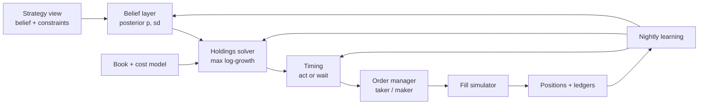

# ArbDesk4 — Improvement Plan for Claude Code (v2)

Written 23 Sep 2026 against `main @ 908427c` (PR #101). Source: the full system audit of the same date.
Line numbers are hints. Code moves, so find each change by the function or symbol named.

**v2 changes (Hassan's decisions of 23 Sep):**
- The existing paper desks are **retired completely**. Focus moves to the trading mechanics: the paper engine, its algorithms and its dynamics, and the inner workings of each strategy (P5, P8).
- The repo **goes private**, so Actions minutes are metered: 2,000 a month on the free plan. Hourly jobs **stay on GitHub Actions** and are designed for minimum billed minutes (P6.1).
- S10 and every other strategy must be **adaptive, not hard-coded**. Thresholds, margins, sizing, timing and holding decisions are learned from evidence and conditioned on the day's state. Only safety rails stay fixed (P5.3–P5.9, P7, P8).

**v2.1 additions (Hassan, 23 Sep evening):**
- **The single-bucket thesis gets its own learning loop.** Every night, per city, every predictor and permutation is scored on the bucket that actually settled, out of sample; the winner prices, with bounded steps and a version (P3.8). Before it can choose between forecast models, the platform must collect more than one (P2.8).
- **Supabase is continuously unloaded into the repo**, not only the rows about to be pruned (P1.7), and the platform reads back everything the repo holds (P1.8).

**v2.2 additions (Hassan, 26 Sep: "I want a superior predictive model"; source: an external audit of the predictive model, each claim checked below against the code and the live database before it was written in):**
- **Predict the station's remaining temperature evolution, not only turn a public daily forecast into buckets.** The public models are the starting point; AD4 learns when, where and by how much they are wrong at the settlement station, and updates that during the day from what the station is actually doing (P2.9, P2.10, P3.9, and the P7.2/P7.3 amendments).
- **Every addition must improve predictions on later dates**, reported per checkpoint and per city, on both temperature error and the winning bucket. The experiment that matters is the morning and pre-peak checkpoints, not after the maximum is apparent.
- **Hit and Miss for US cities lands a day late** because the venue proofs are collected once a day before US days end (P4.7).

**v2.3 additions (Hassan, 27 Sep: assess an external predictive-model plan and "move forward with the improvements if they are fitting"; source: that plan, written against `38f5803`, each claim checked against the code and the live database before it was written in):**
- **The board shows exactly what was priced, and says when that is out of date.** The city card showed the raw public forecast as its "forecast centre", took its "priced" time from the edges, and showed same-day picks the station had already passed (P4.8). Publishing the current prediction between the four-hourly pricing runs is P4.9, sized first against the tick's minute and the database cap.
- **A rerun is not a second night.** Two learners that price live (P3.9, P2.9's blend) step again from their own output when `pipeline_daily` reruns the same night; five more would once their gates open (P5.14).
- **The width describes the distribution served.** P3.9 replaced the day-ahead centre and kept the width fitted to the raw forecast's errors (P3.9 part 3).
- **S10's late day and the evaluation contract** (P7.2, P7.3 amendments), and a note on the S10 market result (P5.3).
- **Where the engine stands (fact_checkpoint_outcome, 24-26 Sep, 404 checkpoints):** on the same ladders the market's log loss is lower at every checkpoint (postpeak_1h 1.260 engine vs 0.776 market; noon 1.522 vs 1.254; d1_eve 1.731 vs 1.239), and after the morning the engine's stated top probability runs above its hit rate (noon 51.5% stated, 36.1% hit; prepeak_1h 52.4%, 42.3%). Day-ahead, 13-26 Sep: 176 of 562 top picks right (`v_city_hit_history`). Three days of intraday evidence, correlated within each day.
- **Checked and not adopted as new steps:**
  - A separate prediction-object table with a serving pointer (its A1): `band_probabilities` and `prediction_checkpoints` already keep every issued ladder, immutable, with its version and time. A pointer waits for P4.9's measurements and the database cap.
  - Two targets, correction by lead, simple combinations first, observed-versus-forecast features, path simulation, and calibration kept apart from skill: already in P7.1, P3.9, P3.8, P7.2 (v2.2) and P3.6.
  - Receipt times: forecasts carry issue times (P2.6) and P2.10 adds publication times. Whether `weather_observations.observed_at` is a receipt time was not checked; it belongs to P2.10's provenance work, not a step of its own.
  - Its "what not to build" list (a neural network first, per-city models on a few days, manual city offsets, a universal confidence threshold, calibration switched on by a date counter) agrees with this plan already.


**v2.4 additions (Hassan, 28 Sep: "we need our predictive model to be superior ... apply scientific methods and quant methods ... whatever makes the platform solid, smart, adaptive and proprietary"):**
- **Superior means better than the price.** The public forecast is not the benchmark any more: every model is judged against the market's own ladder at the same cutoff, and the question that decides trading is whether the model adds anything to the price. The standard way to ask it is a second stage that combines the market's probabilities with the model's (log-linear pooling over the ladder, the method of Benter's horse-racing model), fitted walk-forward (P3.10).
- **Judge on the venue's whole record, not on a handful of days.** Whole priced ladders in the database start 22 Sep; every verdict so far rests on six days or fewer. Polymarket keeps the hourly price of every resolved bucket, so the market's belief at any cutoff can be rebuilt for every city-day it has listed since Dec 2025 (P3.10).
- **The market-trust weight keeps its 20-day minimum** (Hassan left it to what makes the platform solid). P3.10 gives that fit months of independent evidence to start from instead of the prior alone.

---

## 0. How to execute this plan

### 0.1 Standing rules (apply to every step)

1. **One phase = one branch = one or more PRs.** Name branches `plan/p<phase>-<slug>`. Don't mix phases in one PR.
2. **Before every push**, run the whole suite as `CLAUDE.md` requires:
   ```bash
   PYTHONPATH=scripts python -m pytest tests/ -q
   npm ci --prefix tests/database --ignore-scripts && npm test --prefix tests/database
   cd web && ./node_modules/.bin/tsc --noEmit && ./node_modules/.bin/next build   # only if web/ changed
   ```
3. **Every step has three parts:** Change → Test → Acceptance. A step is done only when its acceptance check passes against the **live** database, and the result is pasted into the PR description.
4. **Schema changes go in `supabase/migrations/` only.** Each must be idempotent. List every new `.sql` in `sql/INSTALL_ORDER.txt` (enforced by `tests/test_sql_order.py`). If a migration touches a table the PGlite fixture lacks, add that table to `tests/database/paper-contracts.cjs`.
5. **Never run a data backfill UPDATE on `band_probabilities`** without disabling the research capture trigger first (step P1.4). One untracked UPDATE on 22 Sep wrote about 87 MB.
6. **Strategies may run in `shadow` mode** (P5.2) without asking. Hassan approves anything that puts capital on the **portfolio** account: turning allocation on, the bankroll, and the fixed safety rails.
7. **Actions minutes are a hard budget** (private repo, 2,000 min/month free; **GitHub Pro from 4 Oct, 3,000 min/month for scheduled work and CI together, Hassan: keep the total under it**). **Public from 9 Oct (Hassan): standard runners are not billed on a public repository, so the allowance no longer binds; the budget stays as a guard against a runaway schedule.** Only P6.1 changes `SCHEDULED_MINUTE_BUDGET` / `SCHEDULED_RUN_BUDGET` in `tests/test_github_actions.py`, and it writes the reason into the constant. Every workflow's measured minutes go into `MEASURED_MINUTES`. No new scheduled workflow is added outside P6.1.
8. **Stop and ask Hassan at every 🔶 DECISION gate.** Don't guess.
9. **Measure before and after.** Every numeric claim in a commit message must come from a query that is included in the PR. The audit found many stale or unreproducible numbers in docs and headers.
10. **Update the doc a change affects** in the same PR (see P6.6). Don't leave stale claims.
11. **Adaptive never means unbounded.** Every learned parameter:
    - has a prior;
    - has hard bounds;
    - has a minimum sample before it moves off the prior;
    - has a maximum change per nightly update;
    - carries a version recorded on every decision that used it.

    Nothing learned may be evaluated on the data it was learned from (P5.8).

### 0.2 Phase order and gates

| Phase | Theme | Blocks |
|---|---|---|
| P0 | Baseline, retire old desks, go private | everything |
| P1 | Safety and storage | everything (DB over cap, anon can delete data) |
| P2 | Correct inputs (thermometer, markets, forecasts) | P3, P4, P7 |
| P3 | Correct pricing (engine math, layer gates) | P4, P5, P7 |
| P4 | Honest evidence (decision-time checkpoints) | P5.8, P7 validation |
| P5 | **Paper trading engine v2**: accounts, orders, fills, the shared decision engine, learning loop | P7, P8 |
| P6 | Operations: **minimum-cost hourly tick**, n8n budget, watchdog, views, docs | P6.1 blocks P7.4 |
| P7 | **Max-winning-temperature strategy (S10)**, adaptive | — |
| P8 | **Strategy suite rebuilt on the decision engine** | — |

P7 design work (P7.1–P7.3) can start as soon as P2 is merged. Shadow trading (P7.6, P8) needs P3, P4, P5 and P6.1 done.

---

## P0. Baseline and decisions

### P0.1 Capture the baseline
- **Change:** add `tools/audit_baseline.sql`, holding the acceptance queries in Appendix A. Run it and commit the output as `docs/baseline_2026-09-23.md`.
- **Acceptance:** the file exists and holds numbers for DB size, impossible-band mass, post-close priced rows, station agreement, and decision-time hit rates.

### P0.2 ✅ DECIDED — the repo goes private
- Hassan makes the repo private in GitHub settings. Claude Code can't do this itself.
- After that:
  - Update `CLAUDE.md`, `docs/compute_budget.md` and the budget comments in `tests/test_github_actions.py` to "private, 2,000 min/month free plan".
  - The code and 36 MB of archive data were public until now. No real secrets were ever committed, so nothing needs rotating from the repo itself.
  - After P1.2, **rotate the n8n webhook paths**: they were readable by anon through `settings.n8n_webhooks`.
- **Acceptance:** an anonymous `git ls-remote https://github.com/hassansab00/arbdesk4` fails.

### P0.3 ✅ DECIDED — retire every existing paper desk
- **Change** (a migration plus a one-off script, `tools/retire_desks.py`, run with the service key):
  1. Export every desk's orders, fills, positions, settlements and cash history with `export_paper_trades.py`. Verify the archive with its sha256 in `index.json` (the existing archive guarantees apply).
  2. Mark all 4 desks `status='retired'`, `retired_at=now()`, `retired_reason='plan v2: engine rebuild'`. **Delete nothing**: the 70 trades stay as history.
  3. Disable the `enabled` flag on s1–s9 at the same time (the old gating), and record the change in a `strategy_config_history` table (create it if it does not exist).
  4. Make `queue_plan` refuse any order for an account with status `retired` (PGlite contract test).
  5. Hide retired desks from the board by default, behind a toggle.
- **Acceptance:** 0 accounts with `status <> 'retired'`; 0 queued or live orders; the export row counts match the DB.
- New accounts are created in P5.1.

---

## P1. Safety and storage

### P1.1 Revoke PUBLIC execute on destructive functions
- **Why:** `prune_trades`, `prune_exported_paper_trades`, `paper_desk_reset` and `paper_desk_archive` carry a PUBLIC execute grant (`=X/postgres`) and are SECURITY DEFINER. `ad4_38_grants.sql` revokes from `anon` but never from `PUBLIC`. `prune_trades` also lets `p_before` bypass its 30-day floor.
- **Change:** new migration `…_revoke_public_execute.sql`:
  - `revoke execute on function <each> from public, anon, authenticated; grant execute … to service_role;`
  - Loop over **every** function in `public` with `prosecdef = true`, and revoke PUBLIC from all of them. Re-grant `anon` only on an explicit allowlist of read-safe RPCs. Keep that allowlist in the migration.
  - In `prune_trades`, make `p_before` unable to go below `now() - p_keep_days` (clamp with `least/greatest`).
- **Test:** a PGlite contract asserting `has_function_privilege('anon', …, 'execute') = false` for the four functions.
- **Acceptance:** Appendix A query A1 returns 0 rows.

### P1.2 Put UI writes behind auth
- **Why:** 23 SECURITY DEFINER functions are anon-callable, including `update_setting`, `set_strategy_enabled`, `approve_signal`, `queue_backtest`, `set_run_scope` and `upsert_deployment`. The API routes `/api/paper-desk`, `/api/paper-run` and `/api/paper-cycle` check only the `Origin` header.
- **Change:**
  1. Add Supabase Auth (email magic link) to `web/`, with a single allowed user list held in `settings.operators`, readable only by service_role.
  2. Move every browser mutation behind Next.js API routes that verify the Supabase session JWT server-side. Only those routes call the RPC with the service key.
  3. Revoke `anon` execute on all mutating RPCs.
  4. Remove anon read on `settings.n8n_webhooks` (a column-level grant or a separate table).
- **Test:** web route tests. A request with a forged `Origin` header and no session returns 401.
- **Acceptance:** A2 returns 0 mutating functions executable by anon.

### P1.3 Align archiver floors with the SQL prune floors
- **Why:** in over-cap mode, `effective_keep_days()` sends keep-days of research 1, resolution 1 and trades 14. The live functions refuse below 2, 3 and 30. The dry run fails, the job logs "ARCHIVE COUNT MISMATCH", and **nothing** is pruned for the two largest growing tables.
- **Change:**
  - `scripts/archive_observations.py`: set each dataset's `min_keep_days` to at least the matching SQL floor (research ≥ 2, resolution ≥ 3, trades ≥ 30).
  - Add `tests/test_archive_floors_match_sql.py`. It parses the SQL function bodies for their refusal floors and asserts that Python `min_keep_days >= SQL floor` for every dataset.
  - Make a dry-run refusal log `status='error'` with the reason, not a count mismatch.
- **Acceptance:** after the next archive run, `ingest_log` shows research, resolution and trades pruned with `ok`.

### P1.4 Stop backfills from flooding research_captures
- **Why:** the `preserve_research_output` trigger (AFTER INSERT OR UPDATE on `band_probabilities`) copied 66,345 rows in one hour.
- **Change:**
  - Make the trigger fire only when a pricing column actually changes (`raw_prob`, `calibrated_prob`, `centre_c`, `sigma_c`). Use `when (old.* is distinct from new.*)` on just those columns, or a column list in the trigger.
  - Add a session switch: `if current_setting('arbdesk.skip_capture', true) = 'on' then return new; end if;`
  - Document in `CLAUDE.md` that backfills must `set local arbdesk.skip_capture = on`.
- **Acceptance:** a test UPDATE of a non-pricing column on one row in a transaction (rolled back) creates 0 captures.

### P1.5 Guard the prune on a confirmed push
- **Why:** after 4 failed pushes, the `archive_observations.yml` step still succeeds. `is_committed()` checks local `HEAD`, so rows can be pruned whose archive exists only on a discarded runner.
- **Change:**
  - Copy the `pushed=1` guard pattern from `paper_trade_log.yml`.
  - Change `is_committed()` to `git fetch origin && git cat-file -e origin/<branch>:<path>`.
  - Run the prune step only when the push was confirmed.
- **Test:** unit-test `is_committed` with a temporary repo whose local commit was never pushed. It must return False.

### P1.6 Get under the cap now
- **Order:** P1.3 → P1.4 → run archive via `workflow_dispatch` → confirm VACUUM ran after it.
  - PR #101 reordered the reclaim step. Verify that on the first run after merge.
- **Optional quick wins:**
  - Drop the empty dead tables: `book_capture_attempts`, `ensemble_forecasts`, `regimes`, and `backtest_trades` if it is still empty.
  - Drop the 13 unused indexes reported by the advisor, but only after checking `pg_stat_user_indexes.idx_scan = 0` over 7 days.
- **Acceptance:** A3 `storage_pressure()` < 90% of tier (under 450 MB).

### P1.7 Mirror the proprietary record into the repo every night
- **Why:** the archive exports only rows it is about to prune. What the platform produces and never prunes is in Postgres alone: every price (`band_probabilities`, +6,766 rows a day), every settled outcome (`fact_band_outcome` +831, `fact_forecast_outcome` +955, `fact_signal_outcome` +517 a day), every learned parameter (`derived_*`, `model_versions`), `signals`, and the market and band reference rows. These are 7-day averages measured on 23 Sep. `research_captures` holds JSON copies of six of those tables, but only since 12 Sep. That is the proprietary record, and it has no second copy.
- **Change:**
  - Add a mirror step to `archive_observations.yml` after the archive commit. This uses the existing 03:00 schedule, so no new scheduled workflow is added (rule 7). It **deletes nothing**.
  - Append-only tables are exported by watermark: rows with a key above the last mirrored one go to `data/mirror/<table>/<table>-<from>-to-<to>.csv.gz`.
  - Tables that are rewritten in a trailing window are exported only once their window has closed: `fact_*` rows whose `for_date` is older than databank's 7-day window.
  - Small mutable tables (`cities`, `markets`, `bands`, `model_versions`, `strategy_config_history`, `settings` minus any secret-bearing key) are snapshotted whole. A new file is written only when the content hash changes.
  - `data/mirror/manifest.json` records per file: table, key range, rows, sha256 and the export time. The watermark is read back from the committed manifest, not from the runner.
  - Verify before the commit: re-read each file and match its row count and sha256 against the query that produced it. Push is retried and a failure fails the step, as in P1.5.
  - Add `tests/test_every_table_has_a_home.py`. Every `public` table must be listed as archived (P1.3), mirrored (here), or excluded with a written reason. A new table that nobody classifies fails CI.
- **Acceptance:**
  - After the first run, for each mirrored table, the manifest row count equals `select count(*)` up to the watermark.
  - A second run with no new rows writes nothing.
  - The added minutes are measured and written into `MEASURED_MINUTES`.

### P1.8 The platform reads back what the repo holds
- **Why:** `web/app/api/archive/route.ts` reads GitHub Release assets only. Since #87 (21 Sep) new archive files go only to `data/archive/`, never to a Release. On 23 Sep the repo held 9 observation files and the `observations-archive` Release held 6. So `observations-2026-06-23-to-2026-06-23`, `…-06-23-to-2026-06-24` and `…-06-24-to-2026-07-25` cannot be read by the platform, and the first two are already pruned from Postgres. That breaks "rows leave Postgres only through the archive … so the platform can still read them".
- **Change:**
  - The route reads `data/archive/<dataset>/<asset>` (and `data/mirror/…`) from the repo through the contents API with the server's token.
  - It falls back to the Release for assets that were never committed.
  - Delete the dead Release-upload code in `archive_observations.py` (`ensure_release`, `upload`, `verify`), which is never called.
- **Acceptance:** every entry in `web/public/archive/index.json` returns its row count through `/api/archive`. The test fetches each asset and compares its count with the index.

---

## P2. Correct inputs

### P2.1 Read every METAR, not one per hour
- **Why:** `scripts/ingest_observations.py` (the request param dict, around L64) and the n8n P1.6 template send `report_type=3`, which is routine reports only. The live data holds exactly one minute per hour per station. London, 17 Sep: the venue source had 48 readings with a max of 22 °C at 14:20Z. We had 24 readings with a max of 21. This is the cause of most "we read below" misses (46 of 55).
- **Change:**
  1. **Verify first.** For EGLC and EHAM on 17 Sep and 12 Sep, fetch IEM with `report_type=3&report_type=4` (routine plus specials), and with `report_type=1` if it's available internationally. Compare the reading count and max against the stored WRH payload in `weather_resolution_evidence`. Record the result in the PR.
  2. If IEM returns the half-hourly reports, switch both the Python and the n8n P1.6 template to the combination that matches WRH.
  3. If IEM doesn't, build the running max from the same WRH/Synoptic series that `weather_outcomes.py` already fetches. That source agrees with settlement in 465 of 465 ladders. Keep IEM as a fallback source, labelled as such.
  4. Backfill the last 30 days of observations with the corrected request (with `arbdesk.skip_capture` on).
- **Acceptance:** A4 — a recomputed station-vs-venue bucket agreement of **≥ 97%** across settled ladders since 9 Sep.

### P2.2 Fix `v_station_day_max` / the agreement view
- **Why:** `sql/ad4_82_settlement_agreement.sql` (around L83–91) keeps any row within ±4 minutes of `report_minute`, whatever its source. That lets NWS 5-minute whole-°C rows through (Dallas 13 Sep read 38 °C when the true value was 37.2 °C). The view also never rounds °F values before `band_contains`.
- **Change:**
  - Filter to the chosen primary source (P2.1).
  - Round to the venue's unit and convention before comparing: whole °F for US markets, whole °C otherwise.
  - Put the rounding in one SQL function, `venue_round(value_c, unit)`, and use it everywhere (also in P3.1).
- **Test:** fixtures for the Dallas 13 Sep, NYC 20 Sep and London 17 Sep cases.

### P2.3 Rebuild `observation_trust` from venue evidence
- **Why:** trust is fitted on the worse source. The `ad4_82` header claims the WRH reader agrees 76.2%; the data says 465 of 465.
- **Change:** refit `cities.observation_trust` on the corrected source against the venue winner. Shrink small samples toward the pooled rate (Beta prior, `k=20`), because each city has only about 12 ladders. Store `n_ladders` beside it.
- **Also:** fit per city `q_up` (venue settles one bucket above our reading) and `q_down` (one below), with the same shrinkage. P3.1 uses these.

### P2.4 Keep market state current
- **Why:** 185 past-dated markets are still `closed=false`, and `winning_band_id`/`resolved_band_id` are NULL for every market since 10 Sep. P0.2 discovery polls only today and tomorrow (`days_ahead=2`).
- **Change:** add a pass to P0.2 (or `market_state.py`) that re-polls markets with `resolution_date` in [today−3, today−1] and updates `closed`, the resolution fields and `closed_time`.
- **Acceptance:** A5 — 0 markets with `resolution_date < city local today − 1` and `closed=false`.

### P2.5 One bucket convention everywhere
- **Why:** raw `bands` mixes the inclusive (before 7 Sep) and half-open conventions, and 660 °C markets are tagged `unit='F'`. `v_canonical_bands` corrects all of this, but `databank.py`, `paper_exits.py`, `export_paper_trades.py`, `sql/ad4_86_trajectory.sql` (L118) and `v_settlement_agreement` read the raw `bands` table or `markets.unit`.
- **Change:** switch every reader to `v_canonical_bands` / `v_canonical_markets`. Add a test that greps `scripts/` and `sql/` for `from bands` / `"bands"` reads outside an allowlist.

### P2.6 Real forecast issue times
- **Why:** `ingest_forecasts.py` (around L114) stamps `run_at = for_date − lead` at 00:00 UTC, which is synthetic. And 4,503 lead-0 rows were issued on or after the local target date.
- **Change:**
  - Add an `issued_at` column holding the true issue time, or the ingest time where the true time is unknown, with an `issued_at_source` flag.
  - Every "as of" filter (backtest, replay, P4 checkpoints) must use `issued_at <= decision_time`.
  - Exclude same-day-issued rows from day-ahead skill.

### P2.7 Label live-weather sources
- **Why:** outside the US, `live_weather.temp_c` is Open-Meteo **model** output (`source_kind='model'`). Mexico City's station was 19 hours stale.
- **Change:** no engine or strategy may treat a `source_kind='model'` value as a floor or a "current temperature". Add an assertion in `probability_engine._observed_floors` and in the strategy context builder.
- **Also:** fix the empty IEM window in `live_weather.py` (L82, missing sts/ets) or retire the script. Clean the metadata: the Toronto, Zhengzhou and Ankara `wu_path` values, about 38 Wunderground `resolution_url` values, and `nws_station_id` for the 11 US cities.

### P2.8 Collect every forecast model, not one blend
- **Why:** measured 23 Sep, `weather_forecasts` holds one forecast per city from Open-Meteo, plus NWS for 12 US cities:
  - `open_meteo_forecast`: 41,744 rows;
  - `open_meteo_best_match`: 32,830 rows;
  - `nws`: 2,609 rows.

  Open-Meteo's default is itself a blend chosen by Open-Meteo. With one predictor per city there is nothing to weight, so no loop can learn which model a city should trust (P3.8).
- **Change:**
  - `scripts/ingest_forecasts.py` (the daily previous-runs job, `forecasts.yml` 03:10) requests the individual models through the `models=` parameter, starting with `ecmwf_ifs025`, `gfs_seamless`, `icon_seamless`, `ukmo_seamless`, `jma_seamless`, `gem_seamless` and `meteofrance_seamless`. It writes one row per model under that model's name, in its own table `weather_forecast_models`. Putting them in `weather_forecasts` would let readers that take "the newest row, whatever the model" (`probability_engine._forecast_for`) pick a model by row order, because per-model rows share best_match's synthetic `run_at`.
  - The P1.4/P1.5 n8n live collectors do the same for today and tomorrow.
  - Check the Open-Meteo request count per run against its free-tier limit before switching the schedule on. Record the measured figure, not the documented one.
  - The job's own window is the last 10 days. A one-off manual run over the previous 90 days gives P3.8 three months of per-model day-ahead history straight away, instead of waiting three months for it.
  - P2.6 applies unchanged: these rows are `ingest_time_true_issue_unverified` until P7.2 proves which run each value came from.
- **Acceptance:** for each active city, at least 5 distinct models with a lead-1 forecast for every date of the last 7 days.

---

### P2.9 An honest training record for the desk's own weather model (v2.2)
**Finding (checked 26 Sep):** `scripts/weather_model.py` trains on `derived_city_day_features` (`sql/ad4_21_weather_features.sql`), where `wind_mean` and `cloud_mean` are OBSERVED means over 09:00-17:00 local and `precip_total` is the OBSERVED whole-day sum, and then predicts forward with the FORECAST versions of the same columns (`weather_forecast_features`). Its held-out skill was measured with the afternoon's actual weather in hand, which the morning never has. The promotion gate caught the consequence: on 26 Sep none of 392 city-horizon models was promoted (263 shadow, 129 stale), and on forward days they averaged 0.969 C WORSE than the public forecast (`derived_model_promotion.gain_vs_public_c`).
- **Change:** one training row per (station, target day, cutoff). Its inputs are only: observations with `valid_at <= cutoff`; forecast runs whose publication time `<= cutoff` (P2.6 issue times plus the provider's publication delay, P2.10); the remaining forecast hours; and history known at the cutoff. The label is the eventual station maximum. A future observation is never a predictor.
- Completed-day features stay in `derived_city_day_features` for error analysis. A model fitted on them is never presented or promoted as an advance forecaster.
- **Test:** a lookahead test over the feature builder (no input timestamp after the cutoff), and one proving the training and forward paths read the same source for every feature.
- **Acceptance:** the refitted model's forward-day gain against the public forecast, from `derived_model_promotion`, reported before and after, per lead.

### P2.10 The whole Open-Meteo feed, including archived runs (v2.2)
**Finding (checked 26 Sep):**
- n8n P1.5 asks the Forecast API (best_match only) for hourly `temperature_2m, relative_humidity_2m, dew_point_2m, apparent_temperature, precipitation, precipitation_probability, cloud_cover, wind_speed_10m, wind_direction_10m, surface_pressure, pressure_msl`.
- `scripts/ingest_forecasts.py` asks the Previous Runs API for `temperature_2m` only, for best_match and 7 models (ECMWF IFS, GFS, ICON, UKMO, JMA, GEM, Meteo-France), at leads 1-7.
- None of the variables that govern daytime heating is collected: shortwave/direct radiation, sunshine duration, cloud by layer (low cloud matters most for Tmax), 850 hPa temperature, boundary-layer height, soil moisture, vapour-pressure deficit, gusts. No ensemble spread, and no archive of runs by initialisation time.
- **Change:**
  1. Collect per model: the heating variables above, hourly, for the target days the desk prices.
  2. The Ensemble API for spread (members' Tmax distribution).
  3. The Single Runs / Historical Forecast archives, to backfill training examples by initialisation time. Each run carries its **publication time**, not its initialisation time: a 00Z run is not available at 00Z.
  4. Track model upgrades (a source whose physics changed is a new source for the correction in P3.9).
- **Budget first:**
  - Open-Meteo counts each location and each 10 variables as calls. The free API is for non-commercial use with a daily cap. Measure calls per run before and after, keep production under the cap, and say whether a commercial key is needed.
  - Storage: the Supabase cap (P1.6) means hourly archives go to the repo mirror or parquet (P1.7), not Postgres.
  - Actions minutes (Rule 7).
- **Acceptance:** per model and variable, coverage of the target days priced, and the measured call count per day against the cap.
- **Measured 28 Sep (v2.4, Hassan: new information first):**
  - Budget: the platform's Open-Meteo use today is 2,058-3,792 weighted calls a day (two readings of how models are counted; up to 6,336-14,016 if every retry fires), against a free limit of 10,000; timeouts are already frequent (17 of 48 cities in the first forecasts pass).
  - Availability, probed through the database's pg_net:
    - The Ensemble API keeps members for about four days only (96 of 168 hours of past_days=7; 1 Sep none).
    - The Single Runs API has ECMWF IFS runs from between 1 Apr (absent) and 1 May 2026 (present), with low cloud and 850 hPa (GFS also boundary-layer height).
    - Previous Runs serves radiation at day 1 but no cloud layers, and refuses 850 hPa.
  - The heating variables already collected (P2.9's station model) improve the day-ahead model by 0.027 log loss [0.023, 0.032] but add nothing to the price (`docs/MODEL_VS_MARKET_2026-09-28.md`, Q7).
- **Part 1 (built 28 Sep): the ensemble record.** `scripts/ensemble_record.py`, a step of `archive_observations.yml` (no new schedule; 90 s deadline inside 2 minutes; `MEASURED_MINUTES` 11 -> 13). Once a night, each active city's latest ECMWF (51 members) and GFS (31) ensemble: the members' daily maxima per local day, summarised, with the run's initialisation and publication times, into `data/training/ensembles/` (about 480 weighted calls a night). The test is the P3.10 one: does it add to the price, walk-forward, once 30 days have accrued.

## P3. Correct pricing

### P3.1 Fix the floor atom (critical)
- **Why:** `compute_band_probabilities` sets `effective = floor_c − 0.5`, and `band_mass`'s `F(x)` returns `Phi(x)` at `x == effective`. For a whole-degree reading, that point is exactly a bucket split, so all the sub-floor mass goes to the bucket **below** the observed max.
  - On 22 Sep, the top pick was a bucket the engine's own `band_is_impossible` rejects in 12 of 48 same-day cities. London had read 25.0 °C and the model put 100% on the 24 °C bucket.
  - The same happens in °F: an observed 80 °F put 0.711 on 78–79.
- **Change:** replace the tolerance hack with an explicit model:
  1. Let `R` = the observed running max converted to the venue value with `venue_round` (P2.2), and `b_R` = the bucket containing `R`.
  2. The final max is `M = max(R, X)` with `X ~ N(mu, sigma)`.
     - Continuous part: for each bucket `b`, `P_cont(b) = P(X ∈ b, X > edge_hi(b_R_lower))`, counting only mass above R's bucket's lower settle edge.
     - Atom: `A = Phi(edge_hi(b_R))`, i.e. X settling at or below R's bucket, all assigned to `b_R`.
  3. Measurement layer from P2.3 (per city, shrunk):
     - move `q_down · A` to the bucket below `b_R`;
     - move `q_up · A` to the bucket above.
     - Until P2.3 lands, use pooled defaults `q_down = 0.02`, `q_up = 0.05`, and log that they are defaults.
  4. `band_is_impossible(b)` is true iff `b` lies entirely below `b_R − 1` (two or more buckets below R).
  5. Delete `OBSERVED_FLOOR_TOLERANCE_C` as a mass-moving parameter.
- **Tests** (`tests/test_floor_atom_lands_in_the_right_bucket.py`):
  - The London case (R = 25.0, mu = 24.0, sigma = 0.5, °C): P(24 °C bucket) ≤ q_down + 1e-6, and P(25) ≥ 0.80.
  - The same in °F (R = 80 °F): P(78–79) ≤ q_down.
  - R above the ladder's closed top: all mass goes to the open-high tail.
  - Invariants: the ladder sums to 1, and no probability lands on a bucket that `band_is_impossible` marks impossible (property test over random mu, sigma, R and units).
- **Acceptance:** A6 impossible-band mass = 0 on the next intraday run.

### P3.2 Stop pricing after the local day ends
- **Why:** `_upcoming_markets()` filters on `closed=false` and a **UTC** `resolution_date >= today`. Markets whose local day has already ended (the `closed` flag is stale, see P2.4) get repriced without a floor, and databank freezes that price.
- **Change:** join `cities.timezone` and keep a market only if `resolution_date >= (now() at time zone tz)::date`. Do this in a new view `v_priceable_markets` rather than in Python, so every consumer shares the rule.
- **Acceptance:** A7 — 0 `band_probabilities` rows with `computed_at` after the market's local day end, since the deploy.

### P3.3 Gate the trajectory on fresh readings
- **Why:** `_trajectory_for` never reads `timing_trustworthy`. `v_city_trajectory_now` takes `local_hour` from `now()`, not from the reading.
- **Change:**
  - Add `latest_reading_at` to `v_city_running_max` / `v_city_trajectory_now`, and compute the view's `local_hour` from the reading's time.
  - In `_trajectory_for`, require `timing_trustworthy` and `now − latest_reading_at ≤ 75 min`. Otherwise fall back to the forecast path and add reason `trajectory_skipped:stale_reading`.
- **Tests:** a stale-reading fixture falls back; a fresh one applies.

### P3.4 Forward-only fits with a significance gate
- **Why:**
  - `trajectory.py` `fit_cell` (around L239) and `forecast_postprocess.py` (around L326) train on `rows[:start] + rows[stop:]`, which includes dates after the test block.
  - `derived_climb_profile` uses all days, test days included.
  - Trajectory evidence includes the unsettled current day and drops the 899 rows where our max beat the verified final.
  - Post-processing loses to its baseline on 318 of 392 cells, yet 74 pass a bare `gain > 0` gate.
- **Change:**
  1. Replace `blocked_folds` with an **expanding-window walk-forward**: for each test block k, train on blocks < k only. Put it in one shared helper, `walk_forward_folds(n, k, min_train)`.
  2. Rebuild the climb profile inside each fold from training days only.
  3. Build evidence only from `final_is_verified` past dates, and keep the mismatch rows.
  4. Score exactly what the engine publishes: the P3.1 atom model.
  5. Gate: apply a cell only if the day-block bootstrap (1,000 resamples) **lower 90% bound of the gain is > 0** and `n_days ≥ 20`. Otherwise fall back to pooled-by-hour-band (hours 0–7, 8–11, 12–15, 16–23) under the same gate, then to the public forecast.
  6. Choose K and other hyper-parameters on an inner fold, never on the gating fold.
- **Acceptance:** the PR reports the new count of applied cells and their aggregate out-of-sample gain with its CI. It is fine if fewer cells apply.

### P3.5 Fix skill sample size
- **Why:** `measure_skill.py` (around L145–150) pools one row per model into `by_lead`, which inflates `n_days` about 2.4×.
- **Change:** pick one row per `for_date`, using the same newest-run choice as `_forecast_for`. Keep per-model rows only in `by_model_lead`.

### P3.6 Re-measure calibration after the fixes
- Don't change `calibration.py` logic. After P3.1–P3.3 have run for 7 days, re-run it and ad4_45, and report whether the contradiction has gone: z_sd 0.61–0.66 (too wide) against T = 1.318 (too peaked).
- Tie `pricing_eligible` to evidence: require `n_days ≥ 20` for the city/lead, or mark the row `pricing_eligible=false` with a reason.

### P3.7 Small engine fixes
- Re-apply the 0.25 °C sigma floor after the post-process ratio.
- Fix the `forecast_label` test so it can't mislabel provenance when the trajectory fires on a promoted model.
- Update the lead-0 note in the `ad4_58` header.

### P3.8 The hit tournament: a nightly per-city learning loop on the winning bucket
- **Why:**
  - **Measured on `v_city_hit_history`, 13–22 Sep, day-ahead:**
    - Celsius cities: our top pick was the bucket that settled on 31.3% of 294 city-days. The market's favourite was, on 43.8% of the 283 days both priced.
    - Fahrenheit cities: 27.0% for us against 47.1% for the market.
  - **Seven learners feed pricing, and none of them learns the bucket:** skill, post-process, trajectory, the global T, the ad4_45 width multiplier, the promoted regression model and observation trust. Pricing stacks them in a fixed order: promoted model > post-process > skill, then trajectory, then T. Each is gated alone against its own baseline, on °C error or CRPS.
  - **Only two learners look at the bucket at all.** The global T does, but it is fitted on ladders priced after the local close (P4.3). Observation trust does, but it models the thermometer, not the forecast.
  - **No combination is ever scored.** No city chooses between models, because there is only one (P2.8).
  - **Several learners grade themselves on their own data.** Post-process and trajectory train on folds that include future blocks, and skill, ad4_45 and trust are in-sample (P3.4).
- **Change** (`scripts/hit_tournament.py`, a step in `pipeline_daily.yml`, so no new schedule):
  1. **Evidence.**
     - Rows: every settled city-day with a venue winner (`v_coherent_band_outcome`), its canonical ladder (`v_canonical_bands`), and every forecast whose `issued_at` (P2.6) falls before the checkpoint cutoff.
     - First checkpoint: `d1_eve`, 18:00 local time the day before. P4.2 adds the others; same-day checkpoints bring in the P3.1 floor atom and the P3.3 trajectory.
     - Truth is the venue winner only.
  2. **Candidates.** Each candidate is a full pricing recipe. It is run through `probability_engine.compute_band_probabilities`, the same function live pricing uses, so what is scored is what would be published.
     - Centre, any one of:
       - each model alone;
       - equal-weight mean;
       - median;
       - inverse-error weights per city, shrunk to pooled weights.
     - Bias, any one of:
       - none;
       - the long-run shrunk bias;
       - a recent bias: the EWMA of the city's last residuals, half-life 5 days, bounded ±1.5 °C. This is P7.2's term, brought to the day-ahead path.
     - Width: sigma = a × recent error, where `a` is learned on winning-bucket log loss, per city × lead, shrunk to pooled, bounded [0.5, 2.5].
     - Calibration: with and without the global T.
  3. **Scoring (out of sample).**
     - Expanding-window walk-forward, using P3.4's `walk_forward_folds`: whatever prices day d is fitted only on days before d.
     - Per city × checkpoint, record:
       - winning-bucket log loss (the primary score);
       - top-pick hit;
       - multiclass Brier.
     - The same record for the market's price at the same cutoff and for the uniform ladder.
  4. **Selection, per city, hierarchical.**
     - The pooled champion prices a city unless the city's own best recipe beats it.
     - That needs the lower 90% bound of the day-block bootstrap log-loss gain above 0, on at least 20 settled city-days.
     - A challenger replaces the live recipe only under the same test against it, over the last 30 settled days.
  5. **Rule 11.**
     - Priors are the pooled values.
     - Every parameter has hard bounds.
     - The minimum sample is 20 settled city-days.
     - The maximum change per night: model weight ±0.10, width factor ±10%, bias ±0.3 °C.
     - The version is a hash of the recipe and its parameters. It is written on every `band_probabilities` row in a new `recipe_version` column.
     - The engine's `reasons`, which `main()` drops today, are persisted too, so every price says which layers made it.
  6. **Output.**
     - `derived_hit_tournament`: per city × checkpoint × candidate, with n, log loss, hit, Brier, the market's figures and the fold version.
     - `derived_hit_recipe`: the champion per city, its bounded parameters, its version, and a state of `shadow` or `live`.
     - The engine reads `live` recipes. Until a recipe passes the gate it runs in shadow, which is free under rule 6.
     - Predictive → city shows the champion recipe and its out-of-sample hit rate against the live engine and the market.
  7. **Later.** P4 (checkpoints), P5.8 (strategy learning) and P7.2 (the remaining-day model) add candidates and checkpoints to this same loop rather than building separate ones.
- **Order:**
  - It needs P3.4's walk-forward and bootstrap helpers.
  - It runs with the predictors that exist (one or two per city) until P2.8 lands, then picks up every model automatically.
  - It does not wait for P3.6's 7-day window.
- **Acceptance:**
  - The first nightly run writes a version.
  - The PR reports, per unit, out-of-sample top-pick hit and winning-bucket log loss for the champion, the live engine and the market, each with its bootstrap CI.
  - Recipes go live only where the gate passes. It is fine if none do yet: the report says how many settled days the gate still needs.

---

### P3.9 Learn each source's error at the settlement station, then combine (v2.2)
**Finding (checked 26 Sep):**
- `scripts/forecast_postprocess.py` corrects ONE series (the desk's forecast input) per city and lead: a shrunk bias and a width factor.
- `scripts/hit_tournament.py` chooses between models per city, but on the winning bucket rather than by correcting each model.
- Nothing learns how a source's error depends on the day's conditions.
- **Change:** for each source (model), learn its error at the station (station max - source max) as a function of station and season, lead, cloud and wind (as forecast), recent errors of that source, and the grid-versus-station difference (elevation, coast distance).
  - One pooled, regularised (ridge) regression with modest station effects shrunk to the pool. Not a separate model per city, hour and regime.
  - Then combine the corrected sources. **Equal weights are the benchmark**; learned weights are used only if they beat it on later dates.
  - A boosted-tree challenger may compete later, and must earn its place the same way.
- **Uncertainty** comes from the conditions: disagreement between corrected sources, recent error, uncertain cloud clearing or wind change, missing or old observations, and time left. Agreement between sources is not enough to narrow it, because sources share errors.
- Rule 11 applies: prior (no correction), bounds, minimum n per station before its effect moves off the pool, a maximum step per refit, and a version on every price.
- **Acceptance:** walk-forward on dates after the fit window. Report temperature MAE, CRPS and winning-bucket hit rate for each of:
  - raw best_match;
  - each corrected source;
  - the equal-weight combination;
  - the learned combination.

  Report them per lead and per city, with all eligible events.

**Part 3 (v2.3): the width of the distribution actually served.**
- **Finding (checked 27 Sep):** P3.9 replaced the day-ahead centre and left the width alone ("the width is untouched, because the replay that earned this kept the engine's own sigma", `probability_engine`, the station-correction block). The go-live replay (582 city-days, 13-25 Sep) changed only the centre. The engine's rule for a promoted model is the opposite: "sigma must describe the distribution actually being published". The corrected centre has different errors (centre MAE 1.124 -> 0.820 C on that replay) and is priced with a width fitted to the raw forecast's.
- **Change (research first, shadow until it wins):** fit the width on the walk-forward residuals of the centre actually served (P3.9's combination, and P2.9's blend where it priced), per lead, pooled with shrunk city effects. Candidates, in order: the current width; the served centre's own measured error; a width that grows with the corrected sources' disagreement and the recent residual spread (EMOS-style, fitted on CRPS). Rule 11 as P3.9.
- **Acceptance:** on dates after the fit window, the venue ladder's log loss and Brier, CRPS, and the coverage of the 80% interval, each against the current width, with the P3.4 day-block bootstrap. Nothing prices from it until the lower bound of the gain is above zero.

### P3.10 The venue's record: every model judged against the market on every listed day (v2.4)
- **Finding (28 Sep):** the database holds whole priced ladders from 22 Sep only (older edges and books were pruned into `data/archive`, and those are partial ladders). Every model-against-market verdict so far rests on six days or fewer; the S10 replay could compare log loss with the market on 1-4 days per checkpoint (`docs/S10_REPLAY_2026-09-26.md`).
- **Source (research record, in the repository, never in Postgres):** `tools/market_history.py` reads Polymarket's Gamma API (every "Highest temperature in ..." event, its ladder, its winner, its settlement page) and the CLOB `prices-history` (hourly, per bucket) into `data/training/market_history/`. Measured 28 Sep: 9,983 events, 108,841 buckets, 9,834 resolved; the price series are hourly with gaps of at most 3 h.
- **Part 1, the diagnosis:** `tools/market_vs_model.py` -> `docs/MODEL_VS_MARKET_2026-09-28.md`. Its questions, cutoffs and candidates are fixed in the tool before any score: who prices the ladder better (Q1); centre or width (Q2); whether the model adds to the price, walk-forward by month, market vs the market recalibrated (market^a) vs the pooled second stage (market^a x model^b) vs the linear anchor (Q3); where (Q4); whether the market itself is calibrated (Q5). The model is what the engine serves day-ahead, rebuilt with the engine's own code from the committed record.
- **Decision rule, fixed now:** a second stage (recal or pooled) goes to the engine, in shadow, only if its walk-forward gain over the market has a 90% interval above zero at a checkpoint; the model's weight in it only if pooled beats recal the same way. Rule 11 then applies as everywhere: the record gives the prior (fitted on dates before the live period), hard bounds (a in [0.25, 4], b in [0, 2]), a minimum sample, a maximum nightly step, a version on every decision, and the verdict comes from live dates after 28 Sep only.
- **Part 2:** the intraday checkpoints (S10's remaining-day model after the peak) against the market on the same record. S10's form was chosen on a walk-forward whose test months overlap this record, so its result there is supporting evidence; the live shadow days stay the clean test (P7.3).
- **Results (28 Sep), measured on the record:**
  - **Part 1** (`docs/MODEL_VS_MARKET_2026-09-28.md`; 8,406 city-days at 00:00 and 7,238 at 08:00; 220 dates; 48 cities).
    - The market prices the ladder better. At 00:00 the model's log loss is 1.460 against 1.291, a difference of +0.169 [+0.156, +0.181]; its top pick is right 40.7% of the time against 46.8%.
    - The day-ahead model adds nothing to the price. Pooled over recal: +0.0006 [-0.0014, +0.0026] at 00:00, and -0.0015 [-0.0025, -0.0004] at 08:00. The engine's prior weight on it, 0, is right.
    - The market's own under-confidence is real at 00:00: recal gains +0.0031 [+0.0011, +0.0050]. Buckets priced 50-60% won 60.7% [57.8, 63.5].
  - **Found: the model trains on labels the venue does not agree with.**
    - For C cities before Sep, the station maximum names a lower bucket than the venue's winner on 10.3% of city-days. P2.1's reading of every METAR brings that to 0.0% in Sep.
    - For F cities in Sep, the labels are whole Celsius, and 19.2% name a bucket too high.
    - The same recipe trained on the venue's own truth removes the bias: the median bucket's mean distance from the winner goes from +0.112 to +0.010.
    - It lowers the log loss at 08:00, +0.0079 [+0.0013, +0.0140]; at 00:00 the gain is not shown. It is still 0.163 behind the market.
  - **Part 2** (`docs/S10_VS_MARKET_RECORD_2026-09-28.md`; 6,397-7,130 city-days per checkpoint; 216-219 days).
    - The market is better at every checkpoint before the peak (log-loss gaps from -0.112 to -0.312, every interval below 0).
    - S10's remaining-day model is better 1 h after the peak: log loss 0.663 against 0.679, +0.085 [+0.047, +0.131]; top pick 74.3% against 70.5%, +4.5 pts [+2.9, +6.5].
    - S10's form was chosen on a walk-forward that overlaps these months (see Part 2 above).
    - **Corrected the same day: the post-peak result above leaks.** The replay priced the market at its newest hourly price at or before the decision, a median 59 min old, while the model acts on readings up to the decision hour; the model's top bucket rose 0.077 on average in the hour after. Priced at the first price at or after the decision (`--market-at after`, `docs/S10_VS_MARKET_RECORD_AFTER_2026-09-28.md`), the market is better at EVERY checkpoint, 1 h after the peak included: log loss 0.667 vs 0.406 (-0.192 [-0.242, -0.142], 5,744 city-days); top pick 74.6% vs 80.9%.
  - **Part 3.2** (`docs/S10_AFTER_COSTS_2026-09-28.md`): no edge after costs is shown. At the archived books' real asks, S10's post-peak trades make +0.0257 per share [-0.0539, +0.0993] (53 trades, 8 days). The record's price says +0.1269 [+0.1148, +0.1386] over 2,641 trades, but on the rows where both exist the real ask is 0.077 above it on average and the profit disappears: the record's price for a bucket nobody is trading is a stale quote.
  - **What the record does show:** the market takes time to absorb a new reading (the price of the bucket the reading points to rises 0.077 on average within the hour). Whether that can be traded depends on minutes, which hourly prices cannot resolve: the next measurement is minute prices around each METAR's publication, before anything is built on it.
  - **Q7, the served blend with P2.9's heating variables** (`docs/MODEL_VS_MARKET_2026-09-28.md`): better than P3.9 alone by 0.027 log loss [0.023, 0.032] at 00:00 and 0.029 at 08:00, still 0.142 behind the market, and adds nothing to the price (pooled over recal +0.0015 [-0.0011, +0.0041] at 00:00, -0.0024 [-0.0038, -0.0008] at 08:00).
  - **Part 5, US one-minute readings** (`tools/p310_one_minute.py` -> `docs/ONE_MINUTE_READINGS_2026-09-28.md`; Hassan, 28 Sep: "we need our predictive model to win the single max temp winner").
    - Coverage: 10 US cities (Denver's KBKF has no one-minute archive), Mar-Sep 2026.
    - The signal: a five-minute mean of the station's minute readings entering a bucket above the reports' running maximum. It fired 5,555 times; 3,000 were sampled, on 1,311 city-days.
    - It is real and early: a report followed into the bucket within the hour 75.9% of the time, a median 32 min later (quartiles 16 / 46).
    - The market already prices it: the signalled bucket cost 0.231 on average and won 23.4%, so buying it 2 min after the signal made +0.0034 per share [-0.0042, +0.0111]. The control, the reports' bucket at the same moment, made -0.0420 [-0.0486, -0.0353].
    - No edge. And the one-minute archive is not real time anyway.
  - **Q8, city by city** (Hassan, 28 Sep: win the single max-temperature winner; `docs/MODEL_VS_MARKET_2026-09-28.md`).
    - Method: each city's weight on the Q7 blend, fitted on its earlier months and shrunk to the global weight (n / (n + 60)).
    - At 00:00 the top pick is right 46.5% of the time against the market's 46.3% (+0.0022 [-0.0019, +0.0062] per day, not shown); at 08:00 it is worse than the market.
    - 3 of 48 cities have a gain whose interval is above 0, against ~2.4 expected by chance.
    - The 22 cities that gained through July did not in August-September (-0.0041 [-0.0117, +0.0030]).
    - No reliable niche yet. Watch live, not claimed: Tel Aviv gains at both cutoffs (+0.0332 and +0.0201), on probabilities, not the top pick; the Chinese cities lean positive at 00:00.
    - Follow-up, built 28 Sep: the nightly market-weight fit learns per-city weights in shadow, under two walk-forward tests (P5.3, v2.4 note on per-city weights).
  - **Part 6, the market's favourite at midnight** (`tools/p310_midnight_favourite.py` -> `docs/MIDNIGHT_FAVOURITE_2026-09-28.md`: the one positive finding, the market's under-confidence at 00:00, tested as a winner-first trade).
    - Priced at the first price after 00:00 local, walk-forward band choice: +0.0067 per share [-0.0158, +0.0304], 1,435 trades. Not shown.
    - Every favourite at 00:00: -0.0173 [-0.0271, -0.0077].
    - At the archived books' real ask: -0.0864 [-0.1296, -0.0379], 297 trades. The midnight book is thin and its real ask sits well above the quote, so the under-confidence is a quote nobody can trade at.
    - The single band [0.50, 0.60) looks positive in hindsight (+0.0288 [+0.0037, +0.0541]), but it is one of seven reported, and the walk-forward choice did not reproduce it.
  - **Part 7, the stations around the settlement airport** (`tools/p310_neighbours.py` -> `docs/NEIGHBOUR_STATIONS_2026-09-28.md`, data in `data/training/neighbours/`; Hassan, 28 Sep: new information first).
    - The design was fixed before any reading was fetched:
      - for each city, the 4 nearest METAR stations 10-150 km away that report in at least 70% of hours;
      - two features at 10:00, 12:00 and 14:00 local: the air around warmer than usual relative to the station ("level"), and warming faster ("trend");
      - a placebo from the readings 24 h earlier;
      - the model tilts the market's ladder by the features, on top of the market's own recalibration, walk-forward by month.
    - Coverage: 32 of 48 cities (1,876,936 readings, 1 Dec-26 Sep). Tokyo's, Tel Aviv's and most Chinese cities' nearby stations report too rarely in IEM's archive.
    - **No information beyond the price.** Gain over recal:

      | checkpoint | gain over recal [90%] | placebo |
      |---|---|---|
      | 10:00 | -0.0007 [-0.0011, -0.0003] | -0.0003 |
      | 12:00 | -0.0002 [-0.0006, +0.0001] | -0.0002 |
      | 14:00 | +0.0006 [-0.0006, +0.0019] | -0.0004 |

      The top pick matches the market within 0.3 points. Scored July-September (2,734 / 2,746 / 1,800 city-days): the fits need 1,000 earlier city-days.
    - Checked after reading (disclosed in the tool): the features do relate to the station's remaining rise. At 10:00, +0.709 C per C of "level" [+0.600, +0.821]; partly mechanical, since the station's own reading is in both. So the pipeline is live, and what the neighbours say about the afternoon is already in the price.
  - **Part 4, measured the same day** (`tools/p310_reaction.py` -> `docs/MARKET_REACTION_2026-09-28.md`; one-minute prices around 2,968 new daily maxima, sampled from 28,079, on 207 dates and 48 cities, Mar-Sep 2026). Where the entered bucket's price rises, half of the rise comes a median 11.2 min after the reading's observation time (quartiles 2.3 / 56.2); 1.8% had moved half-way by then. Buying the entered bucket after the reading loses after the spread and the fee: -0.0110 per share [-0.0203, -0.0015] 2 min after, about -0.02 at 5-15 min. The control (the running maximum's bucket at a random minute) is +0.0049 [-0.0023, +0.0121]. **No latency edge in this form.**
- **Part 3 (next, in this order):**
  1. P3.9's correction learns from the venue's truth (the settled bucket, or the venue's reading where `weather_resolution_evidence` has it) instead of the station labels; both label sets are scored on the venue's truth every night. **Built 28 Sep** (`v_venue_truth`, `scripts/venue_truth.py`). P2.9's station model is not switched: it trains on the whole year and the database's venue truth starts 22 Aug, so it is tested first.
  2. Whether S10's post-peak edge survives the cost of trading. The record's price is quoted, not executable; the spread comes from the archived books (23 Aug-24 Sep) and the live book since. **Done 28 Sep: no edge shown** (above).
  3. The market's under-confidence (recal) as a shadow belief at the day-ahead checkpoint, judged after costs like 2. **Done 28 Sep: not shown after costs** (`tools/p310_recal_belief.py` -> `docs/RECAL_BELIEF_2026-09-28.md`).
     - The belief: the market's ladder priced in the hour after the decision, raised to a power a fitted on earlier months (1.07-1.16 across the three decisions) and renormalised. It trades every side of every bucket whose value beats its ask plus fee by more than M, one share each, never above the 0.97 rail.
     - The under-confidence holds on these prices: log loss better than the market at 00:00 by +0.0024 [+0.0006, +0.0043], at 18:00 the evening before by +0.0040, at 08:00 by +0.0017.
     - At quoted prices plus the books' median half-spread, the rule chosen walk-forward makes +0.0626 per share [+0.0242, +0.1015] at 00:00 (273 trades, 96 days); at 18:00 the evening before +0.0050 [+0.0004, +0.0095]; at 08:00 +0.0149 [-0.0156, +0.0435].
     - At the books' real asks (23 Aug-24 Sep) it does not hold: at 00:00 every side with M = 0 loses -0.0665 [-0.1181, -0.0259] (143 trades, 11 days), and M = 0.02 leaves 9 trades, too few to judge. Part 6 found the same gap between the midnight quote and the real ask.
     - Checked after the results were read (disclosed in the tool): the quoted gain is not an artefact of stale ladders; it appears on ladders whose quotes sum to 0.95-1.05 as well (+0.0603 [+0.0151, +0.1051], 189 trades).
     - **Not put in shadow as a view:** the live engine has no 00:00 checkpoint, and the open question is the real ask, which the book archive answers by itself (snapshots every 2 h since 26 Sep, about half of the buckets with a NO ask). **Re-run this tool when its real-ask table at 00:00 covers 45 or more dates (16 on 28 Sep).** It goes to shadow only if the real asks carry it.

## P4. Honest evidence

### P4.1 The `prediction_checkpoints` table (shared with S10)
- **Schema** (new migration). One immutable row per (city_key, target_date, checkpoint, engine_version):
  ```
  checkpoint_id uuid pk, city_key text, target_date date, checkpoint text,   -- see P4.2
  decided_at timestamptz,            -- when the row was written
  local_decision_time timestamp,     -- city-local clock
  engine_version text,               -- git sha
  model_path text,                   -- 'forecast' | 'postprocess' | 'trajectory' | 's10_remaining_day_vN'
  probs jsonb,                       -- {band_id: p} full ladder, sums to 1
  top_band_id text, top_prob numeric, second_prob numeric,
  centre_c numeric, sigma_c numeric,
  running_max_c numeric, reading_at timestamptz, reading_source text,
  forecast_issued_at timestamptz, forecast_model text,
  market jsonb,                      -- {band_id: {best_ask, best_bid, mid, ask_depth_usd_at_limit, book_at}}
  market_top_band_id text,
  inputs_ok boolean, block_reason text
  ```
- Protect it with the immutability trigger and INSERT-only grants, like `fact_band_outcome`.
- Size: about 48 cities × 6 checkpoints × 365 ≈ 105k rows a year, compact.

### P4.2 Checkpoints on the city's local clock
- Fixed labels, evaluated per city in local time:
  - `d1_eve` (18:00 local, the day before)
  - `morning` (09:00)
  - `noon` (12:00)
  - `prepeak_2h` and `prepeak_1h` (from `derived_weather_peak` for city and month)
  - `postpeak_1h`
- The writer is the hourly tick, `scripts/tick.py` (P6.1). On each run it:
  1. selects the cities whose checkpoint falls in the current hour;
  2. calls the probability engine for those cities only;
  3. fetches the CLOB book for their bands;
  4. writes one row per city.

### P4.3 Freeze facts at a declared cutoff
- **Why:** `databank.py` (around L350–371) freezes the newest `band_probabilities` row and the newest edge with no time limit. 302 of 496 frozen ladders were priced after the local close, and the market winners average 0.863.
- **Change:**
  - Keep the existing `fact_band_outcome` for continuity.
  - Add `fact_checkpoint_outcome`: one row per `prediction_checkpoints` row plus the venue winner, `hit = (top_band_id = winner)`, a multiclass Brier and log loss for both model and market, and `market_hit`.
  - Written by databank after venue settlement.
- **Change `v_city_hit_history`** (ad4_85, L52–70): drop the "winner priced by both" condition, and read from `fact_checkpoint_outcome` per checkpoint.

### P4.4 Quarantine pre-9 Sep facts
- **Why:** 531 city-days were settled from our own reading with an interval/unit bug. 34 of 40 checkable days have the wrong winner (for example LA 27 Aug).
- **Change:**
  - Add `fact_band_outcome_exclusions (band_id, reason)` and a view `v_fact_band_outcome_clean` that excludes every row with `captured_at < '2026-09-13'` unless it was re-proven from the venue. Point all consumers at it.
  - Rebuild 27–30 Aug from `paper_resolution_evidence` / `v_venue_market_resolution` into the clean view, where all ladders are venue-confirmed.

### P4.5 Bank what was missed and keep proof on the row
- Make `databank --days` window on proof `captured_at`, not `for_date`. Run it once with `--days 30` to bank the 111 stuck ladders (6–9 Sep).
- Store `proof_id` and `obs_source` on every new fact row at freeze time, so pruning evidence (ad4_74) can't turn banked days into "unverified".

### P4.6 Decision-time scoreboard view
- Add `v_checkpoint_scoreboard`, by checkpoint × (all cities | per city):
  - n city-days, coverage %, model top-1 hit %, market-favourite hit %, public-forecast-argmax hit %;
  - model/market/uniform Brier and log loss;
  - reliability bins.
- The baseline from the audit to beat (13–21 Sep): **noon** model 22.5% vs market 53.7%; **day start** 26.7% vs 46.9%.

---


### P4.7 US city-days are scored a day late (v2.2)
**Finding (checked 26 Sep):**
- Venue confirmations are collected once a day, about 05:00Z, in `pipeline_daily`. A US local day ends at 04:00-07:00Z, so a US day is confirmed on the following day's run.
- Measured: 25 Sep had 32 confirmed C markets at 04:58-05:04Z on 26 Sep, and 0 of 11 F. 55 US checkpoints written for 25 Sep have 0 banked.
- The Hit and Miss table, sorted newest first, therefore shows only C cities on its latest date.
- **Change:** confirm and bank recently ended markets after the US day ends, inside an existing run (the tick or a later daily step), without a new schedule unless P6.1's budget allows it. The panel says which days are still waiting on the venue.
- **Acceptance:** for three consecutive days, the lag between a market's local day end and its checkpoint rows being banked, for C and F cities.

### P4.8 The card shows what was priced (v2.3)
**Finding (checked 27 Sep):**
- `web/lib/cityCards.ts` showed `band_probabilities.forecast_max_c` as the "Forecast centre ... after bias correction". That column is the public input before any correction; the ladder was integrated on `centre_c`, which the ladder views did not expose. For 28 Sep, priced 27 Sep 12:36Z: wuhan 28.9 C shown, 26.005 C priced; paris 23.9 / 25.640; london 19.6 / 19.058.
- The card's "priced" time was the newest edge. The probabilities are written at 00:36, 04:36 ... 20:36Z; the station is read hourly.
- Over the same-day checkpoints of 24-27 Sep (noon, prepeak_2h, prepeak_1h, postpeak_1h; 488 instants), the newest pricing's top bucket got under 1% in the fresh ladder the tick computed at that moment at 68 of them (53 C, 15 F). At postpeak_1h, 38 of 123 card picks lay below the bucket holding the running maximum. The card's pricing was 139-156 minutes old on average at those instants.
- `v_city_prediction_confidence` chose its modal bucket among closed buckets only. On 27 Sep ~15:45Z it named a different bucket from the card on 6 of 92 open city-days, exactly the 6 whose pick was an open tail. No page reads it.
- **Change:**
  - The ladder views carry `centre_c`, `forecast_sigma_c`, `observed_floor_c`, `prob_at` and `priced_from`, from the same `band_probabilities` row as the probability.
  - The card shows the priced centre with the raw input under it (never in its place), the pricing's own time and path, and marks a pick the station has passed since it was priced, by the engine's P3.1 rule. It never swaps in another bucket: a new pick needs a new price.
  - One rule for the most likely bucket everywhere: the most probability, tails included, ties to the lower `band_id` (the card's and `tick.py`'s rule).
- **Acceptance:** before applying, the 30 existing ladder columns are identical in one snapshot (EXCEPT ALL, both ways); read as anon, every open row carries the new columns; the confidence view agrees with the card on every open city-day. After the next pricing run, the card's centre equals `centre_c` for every city.

### P4.9 The current prediction between pricing runs (v2.3)
**Finding (checked 27 Sep):** P4.8 marks a passed pick; it does not replace it. A fresh same-day ladder exists hourly only for the city-days whose checkpoint is due (`prediction_checkpoints`).
- **Change:** measure first: the tick's seconds per re-priced city-day, how many same-day city-days see a new station maximum per hour, and the rows it would add. Then publish the current prediction for those city-days: newest wins, idempotent, a whole ladder or nothing, labelled with its time and path. No hourly appends to `band_probabilities` while the database is over its cap (650 MB, 130% of the 500 MB tier, `storage_pressure()`, 27 Sep ~15:50Z).
- **Acceptance:** a new station maximum never leaves an incompatible pick labelled current; the tick stays inside its minute; the rows added per day are measured against P1.6.

## P5. Paper trading engine v2

**Goal:** one shared decision engine that every strategy uses. A strategy supplies a **view**: a belief about the ladder, or a structural opportunity, plus its constraints. The engine decides everything else from evidence and from the book at that moment: whether there is an edge, how big, **when** to act, which order type to use, and how to manage the position afterwards.

Today each strategy hard-codes its own thresholds (`DEFAULT_MAX_ENTRY_PRICE = 0.90`, `min_edge 0.23`, `width_bands 2`, TTL 30 min…). Those constants are what gets replaced.



### P5.0 Prerequisite fixes (carried over from v1, do first)
Each of these gets a PGlite contract or pytest.
1. **Dedupe:** `queue_plan` refuses a BUY when the account already has an open position or a live order on (band_id, side). Atlanta 17 Sep: one band was bought 5 times.
2. **Order of steps:** exits are evaluated before the worker fills, and exit orders get at least a 30 min TTL. In v1, all 5 of 5 exits expired.
3. **Sizing reaches the order:** `paper_plans.prepare()` must use the engine's target quantity, not `min(max_plan_usd, cash)/unit_cost`.
4. **Positions carry** `strategy_id`, `ledger_id`, `entry_decision_id`, `p_at_entry`, `p_cons_at_entry`, `group_id` (for linked legs) and `params_version`.
5. **Hard floor gate** in `edge_engine`: never buy YES on a bucket that `band_is_impossible` marks (P3.1 semantics), and never treat a `source_kind='model'` reading as the floor.
6. **Venue rounding** before every `_contains` check (s5, s7, `paper_exits.certainly_lost`).
7. **Small fixes:** s7 NO `prob_at_fire = 1 − p`; s6 `size()` returns 0 when Kelly ≤ 0; `cost_version` is never null.

### P5.1 Account model: shadow ledgers and one portfolio account
- **`paper_accounts`**: a new migration adds `kind` (`shadow` | `portfolio`), `strategy_id` (shadow only), `status` (`active` | `suspended` | `retired`) and `bankroll_usd`.
- **Shadow ledgers.** Create one per strategy, automatically, when the strategy is registered.
  - Each trades its own decisions at a **standard notional** (default $1,000, a setting). It is never limited by other strategies.
  - Purpose: clean per-strategy evidence at realistic size. Paper capital is free, so starving a strategy of capital only starves it of evidence.
- **Portfolio account.** One account, where the meta-allocator (P5.10) splits capital across strategies that have earned it, under the risk layer (P5.9).
  - Purpose: what the combined book would have done with real money.
  - It is created **suspended**. It goes active only at the 🔶 P5.10 gate.
- **Settlement:** the existing venue-proof settlement applies to both kinds, unchanged. It is the part of the system the audit found fully correct.

### P5.2 Strategy lifecycle states
- States, stored per strategy in `strategy_state`:
  - `research`: replay only;
  - `shadow`: live decisions on its shadow ledger;
  - `portfolio`: also eligible for allocation;
  - `suspended`;
  - `retired`.
- **Automatic transitions** (no human needed):
  - `shadow → suspended`, when the live log-growth posterior's upper 90% bound falls below 0 over at least 40 settled decisions, or on a fixed-rail breach;
  - `suspended → shadow`, after 14 days, for re-test.
- **Human transitions:** `shadow → portfolio` is a 🔶 Hassan decision, backed by the P5.10 report.
- This replaces the boolean `strategies.enabled`. Keep that column, derived from the state, for the UI.

### P5.3 Belief layer: from model probability to a posterior with uncertainty
- **Input:** the engine's ladder `p_model` at decision time, from the P3 fixes and P7.2.
- **Output:** for every bucket, `p_post` (mean) and `p_sd`. The ladder of means is renormalised to sum to 1.
- **Method:**
  - A hierarchical Beta-binomial reliability map. For each bin of `p_model` (width 0.05), fit realised win frequencies, with partial pooling across `checkpoint_class` (pre-day / morning / midday / pre-peak / post-peak) → `city_cluster` (P5.9) → pooled.
  - Fit on settled checkpoint rows only (P4.3), from dates strictly before today.
  - Each bin's posterior is `Beta(α0 + wins, β0 + losses)`. The prior centre is `p_model` itself and the prior strength is `k0 = 30`. So with little data, `p_post ≈ p_model` but with a wide `p_sd`.
- **Why:** this is what makes every downstream decision adaptive. A bucket the model says is 60%, in a bin that has historically won 45%, is traded as about 45% with honest uncertainty. A bin with no history gets a wide `p_sd`, and the solver automatically sizes it small.
- **Implementation:**
  - `scripts/belief.py`: pure functions plus a loader for `strategy_params['belief']`.
  - Tests: posterior-maths unit tests; with no data it returns the prior; with a heavy history it converges.
- **v2.3 note on the S10 market result (#221).** Post-peak, the market's log loss 0.620 against 0.559 at w = 0.6 (591 rows, 18 days) is a hypothesis, not a weight: 0.6 was the best of a grid on that sample, S10's form was chosen on a walk-forward whose test months include those dates (`docs/S10_REPLAY_2026-09-26.md` says so), and a quote may be up to 3 h old. The clean test is the shadow days after the design froze (P7.6). The nightly fit's walk-forward kept w at 0 throughout. (29 Sep audit: each Monday's refit saw only the days before it, but inside a refit the scope's gate scored its chosen w on the days that chose it; audit repair 4, 30 Sep, made that gate walk forward too.)
- **v2.4 note: per-city weights (28 Sep, after P3.10 Q8; Hassan: "we need our predictive model to win the single max temp winner").** Under each scope (view source x checkpoint class), a city may earn a weight of its own, so a city where the model knows something the price does not can be trusted there alone.
  - **Why guarded:** Q8 found 3 of 48 cities ahead of the market with an interval above 0 on the venue's record, about what chance gives (~2.4), and the cities that gained through July did not in August-September. 48 cities are 48 chances for luck.
  - **The rule** (`scripts/market_anchor.py`, CITIES):
    - the prior is the scope's weight: a city with no entry uses it;
    - a city's estimate counts after `CITY_MIN_DAYS` (20) settled days of its own;
    - a city carries only its difference from the scope's pooled best fit, shrunk by n / (n + 60) days (Q8's constant), added to the scope's weight;
    - **two walk-forward tests, protected:** the cities' shrunk differences, each fitted on the days before, must beat the pooled fit on the day itself, as a family (lower 90% bound above 0, at least 20 such days), and then in that city alone (the same, on its own days). So no city can move before about 40 settled days in its scope;
    - at most 0.05 a night from its last weight, back towards the scope's when a test stops passing; bounds [0, 1]; the table's version on every decision, whose record names the scope used (`engine:morning@tel-aviv`).
  - **Simulated before it runs** (`tools/p53_city_weights_sim.py` -> `docs/CITY_WEIGHTS_SIMULATION_2026-09-28.md`, 48 cities x 60 days):
    - with no city informed, the family test passed on 0 of 30 nights, and 0 of 1,440 city-nights moved;
    - with every city equally informed, the scope's weight rose on all 30 nights, and no city took a weight of its own;
    - with 5 informed cities among 43 that are not, the family test passed on 10 of 10 nights; the 5 moved on 44 of 50 city-nights, and the 43 on 0 of 430.
  - **Shadow:** written nightly to `strategy_params` with the scope weights; read only when `strategy_learning` is on (P5.8), like every learned value.

### P5.4 Execution cost model
- **Taker cost** for quantity q: walk the ask ladder (existing code, correct), plus the fee `rate·price·(1−price)` per share. Return the marginal cost curve, not just the touch price.
- **Maker option:** resting a bid at price `b` has an estimated fill probability and an estimated adverse selection.
  - `P_fill(b, TTL, band_liquidity, hours_to_close)` and `adverse(b)` = the expected mid move against us, conditional on being filled.
  - Both are learned in P5.8 from our own simulated maker orders and from trade prints.
  - Priors: `P_fill` = 0.2 at the touch for 1 h; `adverse` = 0.5 × spread.
- **Exit cost:** walk the bid ladder, plus the fee.
- All in `scripts/execution_cost.py`, with fixture tests on real `raw_book` snapshots.

### P5.5 The holdings solver (replaces per-strategy edge rules)
- **Scope:** one city-day ladder at a time. The buckets are mutually exclusive and exactly one pays $1.
- **Decision variables:** target YES and NO shares per bucket, given current holdings.
- **Objective:** expected log-growth of the ledger, averaged over **posterior draws** of the ladder. Draw 200 Dirichlet ladders whose means are `p_post` and whose concentration matches `p_sd`. Subtract transaction costs from P5.4.
- **Constraints:**
  - the strategy's constraints (for example: S10 is YES-only on one bucket; S12 is NO-only);
  - the risk layer caps (P5.9);
  - depth available at the limit;
  - the fixed rails.
  - Optional `lock` constraint: the net P&L must be ≥ 0 under **every** outcome. This is the equal-shares insurance cap from the old S6.
- **Solver:**
  - For the YES-only, unconstrained case, use the closed-form **horse-race Kelly** set: sort buckets by `p/price`, and include buckets while `p_i/price_i > R`, where `R = (1 − Σp_incl)/(1 − Σprice_incl)`.
  - Otherwise use `scipy.optimize.minimize` (SLSQP). The problem is at most 22 variables, and the objective is concave.
  - Fee-inclusive prices throughout.
- **Aggressiveness:** multiply the Kelly result by the learned fraction `λ` (P5.8). Its prior is 0.25 and it is bounded to [0.05, 0.5].
- **No-trade band:** move from current to target holdings only when the gain in expected log-growth exceeds `h + transaction cost`. `h` is learned (prior 0.002, bounds [0.0005, 0.01]). This single rule replaces separate entry, exit, add, trim and switch rules, and prevents churn.
- **Output:** the target holdings, the expected growth, and each constraint that bound. Every binding constraint is written to the decision log.
- **Tests:**
  - horse-race closed form = numeric optimum on random ladders;
  - no trade when `p_post ≤` cost for all buckets;
  - `lock` never produces a negative outcome;
  - the S10 constraint picks the argmax-growth bucket, not necessarily the argmax-probability one (document the difference, P7.5).

### P5.6 Timing: act now or wait
- **Question at every tick:** is the expected growth of acting now greater than the expected growth of waiting for the next tick, net of the risk that the price moves away?
- **Transition model,** learned in P5.8: from consecutive hourly observations of the same bucket, the joint change of (`p_post`, best ask, depth) over one hour. It is conditioned on:
  - hours to the local peak;
  - the model-vs-market gap;
  - regime;
  - liquidity.

  The data comes from `prediction_checkpoints` and the tick's book snapshots.
- **Rule:** act if `G_now ≥ E[max(G_next, 0)] − c_wait`. `G_next` is simulated from the transition model; `c_wait` is a learned cost of waiting, with prior 0.
  - With too little transition data (n < 500 hourly pairs in the cell), use the prior rule "act when `G_now > 0` and the model-market gap is not shrinking". Log that the prior was used.
- **Why:** it replaces fixed entry windows (S7's pre-peak window, S5's `day_decided`). Early entries happen when the price is cheap relative to the uncertainty; late entries happen when observations have settled the question.

### P5.7 Order manager and fill simulator
- **Order types:**
  - `IOC` taker, as today;
  - `LIMIT` resting, with a TTL of up to the next tick;
  - `CANCEL_REPLACE` at each tick.
- **Choice of order type:** the engine compares the expected growth of the taker and maker options, using P5.4 (`P_fill`, adverse selection) for the maker option. The bias is toward maker when time to close is at least 3 h and the spread is at least 4c.
- **Maker fill simulation** (conservative, `scripts/paper_fill_sim.py`):
  - A resting bid at `b` fills only if, after the order was placed, trade prints at or below `b` accumulate more than the **queue ahead**. Queue ahead = the depth at `b` or better at placement.
  - Trade prints come from `trades_observed.traded_at`. Note that `observed_at` is null on every row today.
  - The fill price is `b`. Partial fills are allowed.
  - The mid 15 min after each fill is recorded for adverse selection.
- **Linked legs** (baskets, locks): execute the least liquid leg first. If a later leg fails, **re-run the solver** with the new holdings, rather than force an unwind.
- **Data needed:** the hourly tick pulls CLOB trades since the last tick for bands with resting orders or holdings only (P6.1), to keep minutes low.
- **Tests:** maker fill replay on recorded prints (fixtures); no fill without prints; a partial fill when volume is below the order size.

### P5.8 Nightly learning loop (`scripts/strategy_learn.py`)
- Runs in the daily chain after `databank`. It learns only from rows with `target_date < today` (walk-forward).
- **What it fits:**
  - belief maps (P5.3);
  - `P_fill` and adverse selection (P5.4);
  - the transition model (P5.6);
  - `λ`: raise it when realised log-growth tracks predicted growth, lower it when realised growth falls short. Update `λ ← clip(λ·exp(η·(realised/predicted − 1)), bounds)` with `η = 0.1`, from at least 40 settled decisions;
  - `h`: from observed churn cost;
  - the cluster correlation matrix (P5.9).
- **Output:** `strategy_params` (`param`, `scope`, `value jsonb`, `version`, `fitted_at`, `n`, `prior`, `bounds`), write-once per version. Each decision row stores the version it used.
- **Guards:**
  - any parameter's value may move at most 25% from the previous version per night;
  - it stays on its prior until its minimum n;
  - out-of-bounds values are clipped and logged.
- **Replay check:** `replay_checkpoints` (P7.3) runs the learning loop day by day over history. The PR must show that learned parameters beat fixed priors on out-of-sample dates (log-growth and Brier). If they don't, the loop ships with **priors frozen** and a flag to enable it.

### P5.9 Risk layer: fixed rails plus dynamic exposure
- **Fixed rails.** Hassan sets these, and they are never learned:
  - max daily loss 5% of the account;
  - max 3% of the account per city-day;
  - max 8% per cluster-day;
  - no YES buys above 0.97 or NO buys above 0.97;
  - no orders in the last 15 min before the local market close;
  - a kill switch (`settings.trading_halt`).
- **Dynamic exposure:**
  - Clusters: group cities by the correlation of their forecast errors on the same date. Use residuals from `derived_forecast_skill` and a Ledoit–Wolf shrunk correlation matrix, refit weekly.
  - The solver's caps on correlated city-days shrink as the estimated correlation rises.
  - Drawdown scaling multiplies `λ` by `max(0.25, 1 − drawdown/0.20)`.
- **Tests:**
  - a rail breach blocks the order even when the solver asks for more;
  - the cluster cap binds on correlated fixtures.

### P5.10 Meta-allocator for the portfolio account 🔶
- Each day, for each strategy in the `portfolio` state:
  - build the posterior of realised log-growth per dollar, **per regime**, from its shadow ledger (Normal-inverse-gamma, prior mean 0);
  - allocate capital by Thompson sampling: draw from each posterior and give weight ∝ max(draw, 0);
  - cap any one strategy at 40%;
  - keep a floor of 0.
- **Suggested gate criteria** before the portfolio goes active, measured on shadow ledgers:
  - at least 30 settled dates;
  - at least 60 decisions;
  - a positive lower 80% bound on log-growth per dollar;
  - no single city-day contributing more than 25% of the gain.
- **🔶 DECISION:** Hassan approves activating the portfolio account and its bankroll (suggested $10,000 paper).

### P5.11 Decision log
- New table `decisions`: one row per (tick, strategy, city-day), even when the action is `NONE`. Columns:
  - the action (`BUY` / `SELL` / `HOLD` / `WAIT` / `NONE`);
  - the reason code;
  - expected growth now and after waiting;
  - binding constraints;
  - `params_version`;
  - `checkpoint_id` / `tick_id`;
  - target vs current holdings.
- Keep it compact: store numbers, not text blobs. Keep 30 days live; the archiver exports it like `edges`.
- The existing `signals` table becomes a view over `decisions`, where the action is BUY or SELL, so the board keeps working.

### P5.12 One engine for live and replay
- The replay harness (P7.3) calls **exactly** the same belief → solver → timing → order → fill code, with as-of inputs.
- Taker fills use `raw_book` ladders, available from 12 Sep. Maker fills use trade prints.
- This supersedes the v1 backtest fix. `scripts/backtest/engine.py` becomes a thin wrapper, or is retired.
- **Acceptance:** a replay over 12–22 Sep produces decisions for every shadow strategy. The replay's decisions for 22 Sep match the live `decisions` rows for 22 Sep, for the same params version, on ≥ 95% of rows.

### P5.13 Archive what research needs
- Before `prune_dead_book_detail` nulls `raw_book`, the hourly tick exports that hour's ladders for bands that have holdings, resting orders or a checkpoint. It does not export all bands, to keep the archive small.
- Include `snapshot_id`, `edge_id` and `observed_at` in the archive CSVs. Bump the schema version in `index.json`.

### P5.14 A rerun cannot step twice (v2.3)
**Finding (checked 27 Sep, code and `ingest_log`):** Rule 11's maximum change per nightly update is measured from the value stored last, so a same-night rerun of `pipeline_daily` (the Relearn webhook, a manual dispatch, a GitHub rerun) steps again from the first run's output, on the same data. Reruns happen: calibration ran 3 times on 22 Sep and twice on 24 Sep, the hit tournament twice on 24 Sep.
- Priced now: `station_correction` (the step's anchor is every stored `bias_c`, overwritten in place) and `station_mos` (every stored coefficient). One rerun moves a held-back cell 0.50 C in a night instead of 0.25.
- Latent: `calibration` (T, once its gate opens), `belief` and `market_weight` (while `strategy_learning` is off), `hit_tournament` (shadow), `meta_allocator` (portfolio inactive).
- Safe: `city_clusters` (it refits only when its last fit is 7 days old).
- **Change:** each learner steps from the value in force before tonight's data cutoff (the previous `as_of`), kept beside the new one, so a rerun with the same data writes the same values.
- **Test:** per learner, a same-night rerun with the same data changes no stored value; a rerun with new data moves each value at most one step from the previous night's.

---

## P6. Operations

### P6.1 ✅ DECIDED — an hourly tick on GitHub Actions, built for minimum billed minutes
**Constraints:** the repo is private, the free plan allows 2,000 min/month, and hourly work must stay on Actions.

**Today's measured cost** (from `MEASURED_MINUTES`; runs × minutes):

| Workflow | Runs/month | Min/run | Min/month |
|---|---|---|---|
| pipeline_intraday | 180 | 6.2 | 1,116 |
| pipeline_daily | 30 | 29.0 | 870 |
| forecasts | 30 | 18.5 | 555 |
| observations, archive, trade log, weather model | ~94 | 1.5–4.0 | ~180 |
| **Scheduled total** | | | **~2,720** |

CI (`tests.yml` on push and PR) comes on top. It is already over the free plan.

**Target design** (projected; the acceptance step measures it):

| Workflow | Cadence | Target min/run | Min/month |
|---|---|---|---|
| `tick.yml` (replaces pipeline_intraday and n8n P1.6) | hourly at :35 | **1 (wall < 55 s)** | 720 |
| `daily.yml` (merges pipeline_daily, forecasts, observations, archive, trade log) | once, chained | ≤ 15 | 450 |
| `weekly.yml` (heavy fits: post-process, trajectory, weather model, clusters, belief maps' full refit) | Monday | ≤ 30 | 130 |
| **Scheduled total** | | | **~1,300** |
| CI, PR-only with path filters and caches | ~80 runs | ≤ 5 | ≤ 400 |
| **All-in** | | | **≤ 1,700** |

**Why the tick must stay under 60 s:** GitHub rounds **each job** up to a whole minute. A 61-second tick costs 2 minutes, which is 1,440 a month on its own.

**Build steps:**
1. **`tick.yml`:**
   - One job with no matrix; `actions/checkout` with `fetch-depth: 1` and sparse checkout of `scripts/` and `requirements.runtime.txt`.
   - `actions/cache` of a prebuilt **venv**, keyed on the requirements hash, with the pip install skipped on a cache hit.
   - One Python entry point, `scripts/tick.py`, runs every stage **in-process**: no separate `python` invocations, no repeated imports.
   - `concurrency: tick` with `cancel-in-progress: false`; `timeout-minutes: 3`.
2. **`scripts/tick.py` work selection.** Only city-days that are **due** get processed:
   - a checkpoint falls in this hour (P4.2);
   - a new forecast run since the city's last price;
   - a new station reading;
   - holdings or resting orders exist;
   - the market closes within 2 h.

   Everything else is skipped, with a reason written to `tick_log`.
3. **Parallel I/O:** a thread pool, or httpx async, for station reads (WRH/IEM, P2.1), CLOB books and trades, and Supabase writes. Batch writes into one upsert per table.
4. **Internal time budget of 45 s**, in this order:
   1. holdings and orders;
   2. checkpoints;
   3. repricing on changed inputs.

   Work left over is deferred to the next tick and logged as `deferred`. It is never silently dropped.
5. **Stages inside a tick,** per due city-day: read station → price (the P3-fixed engine and P7.2 model) → write the checkpoint row if due → decision engine for each strategy in `shadow` or `portfolio` (P5) → order manager → fill simulator → settlement of holdings for markets that closed.
6. **`daily.yml`,** one job, chained stages:
   - forecasts, fetched in parallel (target 18.5 → ≤ 5 min);
   - databank (P4.3);
   - **incremental** settlement sweep: only markets in the last 3 days that lack proof. This replaces the 900-second full sweep;
   - `strategy_learn.py` (P5.8);
   - archive, then VACUUM (the PR #101 order);
   - trade-log export.

   Use `workflow_run` or in-job ordering, never similar cron delays.
7. **`weekly.yml`:** the refits that don't need daily freshness. Post-process and trajectory cells change slowly, and the gate needs n ≥ 20 anyway.
8. **CI:** `tests.yml` runs on `pull_request` only, not on push to main. Add path filters so the web build runs only when `web/**` changes and the PGlite suite only when `supabase/**` or `sql/**` changes. Cache pip and npm.
9. **Retire** `pipeline_intraday.yml`, `forecasts.yml`, `observations.yml` and `paper_fill.yml` (the tick fills orders). Keep `backtest.yml` and `verify_resolution_source.yml` as manual dispatch only.
10. **Update `tests/test_github_actions.py`:**
    - `MEASURED_MINUTES` for the new files;
    - `SCHEDULED_MINUTE_BUDGET = 1400`, with the reason "private repo, free plan 2,000; ~400 left for CI";
    - `SCHEDULED_RUN_BUDGET = 800`, with the reason "hourly tick replaces 6-hourly intraday; minutes fall".
    - Add a test that fails if `tick.yml` has more than one job or any `matrix`.
- **Acceptance** (after 7 days):
  - p95 tick wall time < 55 s, measured with `gh run list --workflow tick.yml --json` and the jobs API;
  - the projected monthly total from measured runs, CI included, is ≤ 1,700;
  - 0 ticks over 60 s billed;
  - checkpoint coverage A8 ≥ 98%.
- **Fallback, only if the acceptance fails after optimisation:** drop the tick to every hour **only while any city is inside its checkpoint or holding window**. Compute the cron as a list of UTC hours from `derived_weather_peak`, and regenerate it monthly. Don't move off Actions.

### P6.2 Bring n8n under 2,000 executions a month
- **Retire** P1.6 hourly observations: the tick reads stations itself. That saves 720 executions a month.
- Move P0.3 to every 2 h (saves 360).
- Make `v_execution_budget` match the real schedule.
- The n8n instance is shared with the Stratify/Steelwyre workflows, so measure the whole instance's monthly total after the change, not just AD4's.
- **Acceptance:** the instance total is under 1,800 a month.

### P6.3 Watchdog that sees and speaks
- P4.1 counts `status='error'`, but jobs now log `attention`/`partial`, so it always reports 0.
- Change it to alert on **the age of each job's last `ok`**, against a per-job SLA table (for example: probability_engine 5 h, tick 90 min, databank 26 h, archive 26 h).
- Turn on email (SMTP credentials plus a recipient). Separate `attention` into real warnings and informational notes: `edge_engine` is `attention` on 49 of 49 runs.
- Make `common.log_run` raise if its own write fails.

### P6.4 Secure webhooks and the dispatch token
- Add a header secret to every n8n webhook. Remove `allowedOrigins: *`.
- Give the n8n P2.1 relearn workflow a fine-grained GitHub PAT limited to `actions:write` on this repo, and only after the webhook has auth.

### P6.5 Fix the slow and broken board views
- Materialise, or cache in a refreshed table, `v_opportunities`, `v_strategy_board`, `v_trade_plan`, `v_city_reasoning` and `v_data_freshness`. Refresh them at the end of each tick (P6.1).
- Frontend fixes:
  - Board reads `v_latest_book` filtered to current band ids.
  - Live-mode forecast key uses the city's local today (`board/page.tsx` L221).
  - Monte Carlo panel uses `centre_c`/`sigma_c` and the atom.
  - Pass `limit` so truncation flags fire.
  - Show errors instead of hiding panels.
  - One P&L source per strategy.
  - Update the stale "all strategies disabled" copy.
- Label every analytics chart with its decision time. Replace the end-of-day comparison with `v_checkpoint_scoreboard`.
- **Acceptance:** 0 statement timeouts in 24 h in the Postgres logs.

### P6.6 Docs clean-up
- Retire `DO_THIS_NOW.md` and `EVERYTHING.md`.
- Rewrite `compute_budget.md`, `skill_baseline.md` and `n8n_workflows.md`.
- In `STRATEGY_EVIDENCE_2026-09-22.md` §1, restate the decision-time numbers and remove "timing is not a confound".
- In the `trajectory.py` header, replace "0.808 vs 0.098" with numbers from `v_checkpoint_scoreboard`.
- In the `ad4_82` header, remove the 76.2% claim.
- Update `OPEN_ITEMS.md` §1, §2 and §3 to their real state.
- Fix the 3 clock-dependent tests in `test_n8n_code_nodes`, by freezing time.
- Clean up `settlement.py`: delete it, or move it under `scripts/legacy/`.

---


## P7. The max-winning-temperature strategy (S10), adaptive

**Thesis.** For each city and target date, predict the single bucket that will settle YES, using what the settlement station has already recorded and how much higher the day can still go. Hold **one YES bucket per city-day**, chosen and managed by the P5 decision engine, so that nothing about when, how much or whether to switch is hard-coded.

**Two separate outputs, always:**
- a **prediction**: the top bucket and its posterior probability, written for every eligible city-day at every checkpoint;
- a **trade decision**: from the decision engine on every tick (`BUY` / `HOLD` / `SWITCH` / `SELL` / `WAIT` / `NONE`), with a reason.

Accuracy is measured on all predictions. Profit is measured on decisions.

**Targets** (to be tested, not promised):
- 50–60% top-bucket accuracy on **selected** checkpoints, reported next to coverage and next to the market favourite's hit rate at the same instant.
- Current decision-time baseline to beat: 22.5% at noon (market 53.7%).

**What "dynamic" means for S10, concretely:**

| Was hard-coded (v1 plan / old strategies) | Now decided by |
|---|---|
| Fixed checkpoints to enter | Every tick; act-or-wait from the transition model (P5.6) |
| `margin = 0.06` | Posterior uncertainty `p_sd`, cost curve and adverse selection inside the log-growth solver (P5.3–P5.5) |
| `p_cons = p − 0.10` or a Wilson bound | Hierarchical reliability posterior per checkpoint class, cluster and p-bin (P5.3) |
| 0.25× Kelly | Bayesian Kelly over posterior draws × learned `λ`, drawdown- and cluster-scaled (P5.5, P5.8, P5.9) |
| "Never switch" | Switch when the growth gain beats exit + entry cost + learned hysteresis `h_switch` (P7.5) |
| Hold to settlement | Hold, add, trim or sell every tick from the same solver; `certainly_lost` still exits at once |
| Taker only | Taker vs resting bid chosen by expected growth (P5.7) |
| One model width per city-hour | State-dependent spread from the remaining-day model (P7.2) |

### P7.1 Contract and eligibility
- Add `docs/S10_MAX_TEMP_WINNER.md` holding the definitions below, frozen before any evaluation:
  - **Eligible city-day:** active city; canonical ladder complete; station agreement ≥ 95% after P2 (per `observation_trust`, n ≥ 10); market open; settlement source matches rules text.
  - **Checkpoints are evaluation anchors, not trading times.** Predictions are scored at the P4.2 labels; each checkpoint is scored on its own; a city-day counts **once per checkpoint**; repeated updates never count as extra wins. **Trading decisions happen on every tick** (P5.6 decides when).
  - **Metrics:**
    - full-coverage top-1 accuracy;
    - selective accuracy plus coverage, at confidence thresholds 0.4/0.5/0.6;
    - reliability of top_prob;
    - Brier and log loss against the market and the public forecast at the same timestamp;
    - per-city, per-regime and per-date breakdowns.
  - **Truth:** the venue winner only (`paper_resolution_evidence`). Station max is used only as a training label where no venue exists, and is flagged `label_source`.

### P7.2 The remaining-day model (`scripts/remaining_day.py`)
Predicts the distribution of the **final daily max** from what has happened so far and what is left of the day. Build it in stages, and keep each stage only if it beats the previous one out of sample (P7.3).

- **Stage 0 — baseline (no new model).** P3.1 atom model over the P3.4 forward-fitted trajectory and post-process layers. This is what S10 runs in observe mode on day one.
- **Stage 1 — two-part pooled model.**
  - **Target** at a checkpoint with running max `R`: the additional rise `Y = final_max − R ≥ 0`.
  - **Part A:** `P(Y = 0)`, i.e. "the max is already set" (logistic).
  - **Part B:** `Y | Y > 0`. Use quantile regression (q = 0.05…0.95) or a gamma GLM. Choose whichever gives lower CRPS in walk-forward testing.
  - **Features**, all known at decision time:
    - local hour, and hours until the city-month mean peak hour (`derived_weather_peak`);
    - hours until sunset;
    - `temp_now − R`;
    - 1 h and 3 h slopes (`ad4_26_temp_trend`);
    - **forecast remaining max** = max of the hourly forecast over the remaining local hours minus `temp_now`. This is the key feature, and must be from a run with `issued_at ≤ decision time`;
    - forecast daily max minus R;
    - cloud cover now and forecast, wind speed and direction change, dewpoint depression;
    - latest forecast revision (newest run minus previous run);
    - month;
    - a city random effect, shrunk to pooled.
  - **Pooled across cities** with city effects. Don't fit a separate model per city-hour: that is what gave 8–16-day cells.
  - **Uncertainty depends on the state (heteroscedastic).** The spread of the remaining rise is itself a function of the features: slope, cloud, the size of the forecast remaining rise, and **cross-model disagreement**, which marks sharp days versus uncertain ones. Width must not be one number per city-hour. Test that the predicted spread is wider on high-disagreement days and that the coverage of the 80% interval holds in each regime tercile.
  - **Adaptive between refits.** The weekly refit (P6.1 `weekly.yml`) re-estimates the coefficients. The nightly loop (P5.8) updates only the shrunk **city effects** and a **recent-bias term** (an exponentially weighted mean of the last 10 days' final-max residuals per city, half-life 5 days, bounded ±1.5 °C). The model tracks seasonal drift without refitting everything.
  - **Output:** the final-max distribution, converted to buckets through P3.1 (venue rounding plus q_up/q_down).
  - **v2.2 additions (audit, 26 Sep).**
    - **Observed-versus-forecast discrepancy features, all as of the decision time:**
      - temperature error over recent readings;
      - observed versus forecast warming rate;
      - observed versus forecast cloud;
      - wind direction and speed change;
      - forecast revisions of the remaining hours (newest run minus previous);
      - remaining solar radiation and daylight.
    - How long a morning error persists is **learned**, never assumed: sometimes it persists and sometimes the forecast catches up. Cloud errors and coastal airflow get particular attention. No hard-coded rule such as "dry air means more warming".
    - **A noisy reading is not an unquestionable floor.** Station reading error and official settlement corrections are modelled separately, so the atom at R carries observation uncertainty.
    - **Peak timing is an output, not an assumption:**
      - the probability of exceeding the current maximum;
      - the probability of crossing the next bucket boundary;
      - the distribution of when a new maximum could occur over the whole remaining settlement window.

      The city's mean peak hour is a feature, not the answer.
    - **Later candidate:** simulated remaining-day temperature paths, with the maximum taken per path. Adjacent hours must stay dependent; independent hourly draws exaggerate the maximum.
    - **Outputs kept distinct:**
      - the predicted maximum (median);
      - a prediction interval with stated coverage;
      - the most likely settlement bucket, computed from the full distribution under the venue's rounding (it is not necessarily the bucket holding the mean);
      - the probability of further warming.
- **Stage 2 — only if Stage 1 wins.** Try gradient-boosted quantiles (LightGBM) on the same features. It must beat Stage 1 walk-forward by the P3.4 bootstrap rule.
- **Before any observation exists** (the `d1_eve` checkpoint, and `morning` for late-peaking cities): the model reduces to the corrected forecast distribution. Make sure the Stage 1 features let the forecast dominate when `R` is uninformative, and test that it does.
- **Training data:**
  1. Observations: `data/archive` (from ~2024) plus the live table, plus a one-off IEM/WRH backfill of 2 years for all active stations, using the corrected P2.1 request. Store it as parquet in a GitHub Release, **not** in Supabase.
  2. Hourly forecasts as issued: verify whether the Open-Meteo Previous Runs / Historical Forecast API gives hourly values for past issue times. If it does, backfill 12+ months. If not, Stage 1 trains on the live period only, and the plan says so.
  3. Labels: the venue winner where available; otherwise the station max from the P2.1-quality series, flagged.
- **Model registry:** each stage is registered in `model_versions` with its training window. The engine prices with the newest version whose replay (P7.3) beat the previous one; the others keep running in shadow scoring. Promotion between stages is automatic under the P3.4 bootstrap rule, and a demotion follows if the live 30-day CRPS falls back below the previous stage.
- **Tests:** feature functions are pure; there is a lookahead test (no feature reads a timestamp after the decision time); the output ladder sums to 1; and the atom invariants from P3.1 hold.
- **v2.3 additions (checked 27 Sep).**
  - **The late day is unsupported, and says so.** Stage 1 fits local hours 07-17 (`remaining_day.HOURS = range(7, 18)`) and needs 6 forecast hours left (`MIN_REST_HOURS`), so a later checkpoint gets no S10 row. Until a tested late-day model exists, a late checkpoint falls back to the floored forecast and the row names the fallback. No "after 17:00 the day is done" rule, and no probability removed because the usual peak hour has passed.
  - **"Already set" is an approximation.** Part A's zero-rise event is a rise under 0.25 C, not an exact zero. Crossing a bucket boundary is scored under the venue's rounding.

### P7.3 Historical replay harness (`scripts/backtest/replay_checkpoints.py`)
- For every past city-day and checkpoint, rebuild the inputs **as of** the decision time: observations with `valid_at ≤ t`, forecasts with `issued_at ≤ t`, and the model trained only on dates before the target date (expanding window, retrained weekly).
- Write rows to `replay_checkpoints` in the same shape as `prediction_checkpoints`. Keep them in parquet or a separate schema, not the live DB, because of the cap.
- Report `v_checkpoint_scoreboard`-equivalent metrics for Stage 0, Stage 1 and the public-forecast argmax. The market comparison is only possible where books exist (from 22 Aug, full ladders from 12 Sep).
- From 12 Sep onward, the replay also runs the **full decision engine** (P5.12) for each S10 variant (P7.5), with the learning loop replayed day by day. That gives a hypothetical trading record before any live shadow day.
- **v2.2: the version ladder.** Build and compare, in this order, each kept only if it improves on later dates:
  1. the current forecast path;
  2. the corrected forecast combination (P3.9);
  3. that combination updated with the day's observation errors;
  4. the remaining-day maximum distribution (P7.2 Stage 1);
  5. a more flexible model, only if needed.

  Report temperature error, winning-bucket hit rate and probability quality, per checkpoint and per city, with all eligible events. The experiment that decides is **morning and pre-peak**.
- **Acceptance:** a replay report in `docs/S10_REPLAY_<date>.md` with n, coverage, accuracy with Wilson CI per checkpoint, reliability, and CRPS/log loss against the baseline.
- **v2.3: the evaluation contract, frozen before any new model search.**
  - The primary score is the venue ladder's multiclass log loss, with Brier beside it. For temperature: CRPS, and the coverage and width of stated intervals; then the median's MAE and bias, top-1 and top-2 hits. Every table carries eligible, scored, skipped, stale and abstained counts, so no model wins by dropping hard days.
  - Uncertainty comes from a date-block bootstrap that keeps every city and checkpoint of a date together. Dates, city-days and checkpoints are reported separately.
  - A checkpoint row is a decision at `decided_at` on a reading from `reading_at`, not an exact-time forecast (Munich 26 Sep "noon": reading 12:20 local, decided 12:37). Live comparisons with the market use the book read in the same tick; exact-time research rebuilds inputs as of the scheduled time.
  - Replay dates that overlap a model's design are not untouched evidence. A model is promoted on dates after its design froze, and every candidate tried is recorded.

### P7.4 S10 inside the hourly tick
- No separate runner: `scripts/tick.py` (P6.1) prices due city-days with the approved remaining-day model, writes checkpoint rows when due, and calls the decision engine for S10.
- **What makes an S10 city-day due, beyond the P6.1 rules:**
  - the P(max already set) from P7.2 changed by more than 0.1 since its last decision;
  - the top bucket's ask moved by at least 2c.
- **Acceptance:** 7 consecutive days where every eligible city has a checkpoint row for each of its 6 checkpoints (A8 ≥ 98%), and every held position is re-decided at least hourly (`decisions` coverage).

### P7.5 The S10 view and its variants (`scripts/strategies/s10_max_temp_winner.py`)
S10 is a **view plus constraints**. It contains no thresholds of its own.
- **View:** the remaining-day ladder from P7.2 → belief layer (P5.3) → `p_post`, `p_sd` per bucket.
- **Constraints passed to the solver:** YES side only; at most one bucket held per city-day; the risk-layer caps.
- **Switching rule** (the only S10-specific logic): if the solver's best single-bucket target differs from the held bucket, switch only when:
  - the growth gain > (exit cost of the held bucket + entry cost of the new one + `h_switch`);
  - `h_switch` is learned in P5.8, with prior 0.005 and bounds [0.001, 0.02].
  - A switch is logged `SWITCH`, with both buckets and both posteriors.
- **Certainly lost:** if the held bucket becomes impossible (P3.1 semantics, venue-rounded), sell at the bid at once, whatever the solver says.
- **Variants,** registered as separate strategies so each gets its own shadow ledger and the evidence decides. Running them in shadow is free.

  | Variant id | Target | Switching | Overlay |
  |---|---|---|---|
  | `s10_winner` | the most-probable bucket only (Hassan's thesis in its pure form) | allowed with hysteresis | none |
  | `s10_growth` | the single bucket with the highest expected growth (may be the second-most-likely if it is much cheaper) | allowed | none |
  | `s10_lock` | as `s10_winner` | allowed | may add competitor buckets **only** when the P5.5 `lock` constraint holds, i.e. the old S6 equal-shares insurance rule, which never loses on any outcome |

  Every decision row records whether the traded bucket equals the predicted top bucket, so accuracy and trading stay separable.
- **Tests** (fixtures from real 22 Sep ladders):
  - no buy on an impossible bucket;
  - no buy on stale or model-sourced readings;
  - a switch happens only across the hysteresis;
  - `s10_lock` never has a negative outcome;
  - the variants differ only in constraints: the same inputs give the same `p_post`.

### P7.6 Shadow mode
- All three variants start in `shadow` (P5.2) as soon as P5 and P6.1 are live. That means real decisions, simulated fills on live books, and venue settlement on the shadow ledgers.
- The daily report `docs/S10_SHADOW.md` is generated by `daily.yml`, not hand-written. Per variant:
  - decisions;
  - fills (taker vs maker);
  - hit rate of the held bucket;
  - realised vs predicted log-growth;
  - a slippage estimate: simulated fills vs mid;
  - switches, and their outcomes.

### P7.7 🔶 DECISION — S10 into the portfolio
- Apply the P5.10 criteria per variant. Present the scoreboard (A9), the shadow report and the replay report to Hassan.
- Also ask:
  - which variant or variants go to the portfolio;
  - whether S10 becomes the primary strategy, displacing the S6 anchor-plus-insurance concept as the core idea. `s10_lock` keeps that idea alive inside S10.

### P7.8 Board changes for S10
Per city, show:
- predicted bucket, `p_post ± p_sd`, and the market's price;
- running max, reading age and source;
- P(max already set) and the expected additional rise;
- each variant's holding, its last decision and the reason: why it waits, why it doesn't switch;
- the binding constraint, when there is one;
- the model stage and params version.

Analytics shows `v_checkpoint_scoreboard`, with accuracy always next to coverage and decision time, plus each variant's shadow-ledger curve.

### P7.9 End-to-end chain (definition of done for P7)
```
station reading (P2) → remaining-day distribution (P7.2) → bucket ladder (P3.1)
→ belief posterior (P5.3) → solver + timing (P5.5–P5.6) → order + fill (P5.7)
→ venue settlement → decision + checkpoint outcomes (P4.3, P5.11) → nightly learning (P5.8) → next tick
```
Every link writes a traceable row with a reason. A green workflow run is not evidence that a prediction reached the strategy. The coverage query A8 and the `decisions` coverage are.

---

## P8. The strategy suite, rebuilt on the decision engine

**Principle:** a strategy is a **hypothesis about where the edge comes from**, expressed as a view plus constraints. Thresholds, widths, entry windows and sizes are no longer written into strategy files. The engine and the learning loop set them (P5). Each strategy starts in `shadow`, and its shadow ledger is its evidence.

### P8.1 🔶 DECISION — consolidate the old nine into five hypotheses
Several old strategies were fixed-parameter versions of the same idea. The engine makes them special cases of one another, so keeping them separate would split evidence and double-trade the same city-days. Proposed lineage (history and old signals are kept; only the strategy ids are retired):

| New | Hypothesis (where the edge comes from) | Replaces | View | Constraints |
|---|---|---|---|---|
| **S10** (3 variants, P7) | We know the settlement station's day better than the market, especially late in the day | S5 running-max lock, S7 pre-peak gradient (their inputs become P7.2 features and P5.6 timing) | remaining-day ladder | YES, one bucket |
| **S11 ladder optimiser** | The market misprices the *shape* of the distribution: too flat on sharp days, too narrow on uncertain ones | S3 concentration, S8 two-bucket cover, S9 ladder basket | full ladder posterior | YES, any set; variant `s11_lock` adds the no-loss constraint (old S6 idea) |
| **S12 overpriced-bucket NO** | Buckets the market overprices, tails especially, can be sold via NO | S4 tail fade | full ladder posterior | NO only |
| **S2 structural arb** | Ladder prices that sum past 1 after fees are a riskless basket | S2 (kept) | none (prices only) | all legs or none, within tolerance |
| **S13 price-drift** (research only) | Prices over- or under-react to forecast releases and observations | S1 buy-low / sell-signal | transition model (P5.6) | stays `research` until the replay shows out-of-sample predictive power |

- The old `concentration beats breadth on sharp days` finding needs no rule in S11. On sharp days the posterior is concentrated, so the horse-race Kelly set is naturally small; on uncertain days it widens. Replay must show this happening (P8.3 test).
- Ask Hassan to approve the consolidation. If he wants any old strategy kept as its own id, re-express it as a view plus constraints on the engine: no thresholds in the file.

### P8.2 Implementation per strategy
Common to all:
- **File shape:** `view(ctx) -> ladder posterior or opportunity` and `constraints(ctx) -> dict`. Nothing else.
- **`tests/test_strategies_have_no_magic_numbers.py`:** parses every file in `scripts/strategies/` and fails on any numeric literal other than 0, 1 and constants imported from `risk_rails.py` or `strategy_params`. This is how "not constrained as they are" is enforced mechanically.
- **Regime:** `regime.py` labels become **features** of the belief layer and the allocator (cross-model disagreement tercile, dry/cloudy, front passage). They are no longer hard gates.

Per strategy:
1. **S11 ladder optimiser.** Solver with YES-only and any set of buckets; horse-race closed form when unconstrained. The `s11_lock` variant adds `lock`.
   - Tests: the set shrinks as the posterior concentrates; it is empty when every `p/price ≤ R`.
2. **S12 overpriced-bucket NO.** Solver with NO-only. NO price = 1 − YES bid, from the book, and NO probability = 1 − p_post for each bucket.
   - The belief layer's tail bins get their own reliability cells (p < 0.1), because tail calibration is where this edge lives or dies. In the audit's noon reliability the 0–10% bin was near calibrated: 2.9% stated vs 3.5% realised on 3,240 bands.
   - Tests: no NO on a bucket that is already certainly lost for YES; sizing falls as `p_sd` rises.
3. **S2 structural arb.** Opportunity when Σ(fee-inclusive YES asks at size q) < 1 − `buffer`. `buffer` is learned from observed leg failure and slippage, with prior 0.01 and bounds [0.002, 0.05].
   - Execution: least liquid leg first, all within one tick; on a leg failure, re-solve.
   - The ladder must be complete (verified; 65 of 65 today).
4. **S13 price-drift (research).**
   - From the P5.6 transition data, fit whether the next-hour price change of a bucket is predictable from (model−market gap, time since forecast release, time since new reading, order-book imbalance).
   - It is promoted to `shadow` only if walk-forward out-of-sample R² > 0 with a bootstrap lower bound above 0 on at least 30 dates.
   - Until then it produces no decisions, only the report `docs/S13_RESEARCH.md`.
5. **Retire** s1, s3, s4, s5, s6, s7, s8 and s9 as strategy ids (state `retired`). Their code moves to `scripts/strategies/legacy/`, kept for replay comparisons, with no registry entry.

### P8.3 Suite-level acceptance
- Replay 12 Sep → today: every new strategy produces decisions, with no look-ahead (lookahead test passes).
- In replay, the S11 average basket size is smaller in the lowest cross-model-disagreement tercile than in the highest.
- `decisions` show no two strategies holding opposite sides of the same band on the portfolio account (conflict rule: the solver sees portfolio-level holdings when the portfolio is active).
- The no-magic-numbers test passes.

### P8.4 Conflict and interaction rules (portfolio account only)
- On shadow ledgers, strategies never interact. That is the point of shadow evidence.
- On the portfolio account, the solver runs **once per city-day across all allocated strategies' views**. It blends their views weighted by allocator share and applies the union of their constraints where they are compatible. This avoids opposite-side trades and double exposure by construction, rather than through the old pairwise `conflicts.py` rules.
- `conflicts.py` is reduced to a validation check that fails loudly if the solver ever outputs a YES and a NO on the same band for the portfolio account.

---

## Appendix A — Acceptance queries

Run these with the Supabase SQL tool against the live DB (read-only). The expected result follows each one.

**A1 — no PUBLIC or anon execute on destructive functions** → 0 rows
```sql
select p.proname from pg_proc p join pg_namespace n on n.oid=p.pronamespace
where n.nspname='public' and p.prosecdef
  and p.proname in ('prune_trades','prune_exported_paper_trades','paper_desk_reset','paper_desk_archive')
  and has_function_privilege('anon', p.oid, 'execute');
```

**A2 — mutating functions anon can call** → 0 (after P1.2)
```sql
select count(*) from pg_proc p join pg_namespace n on n.oid=p.pronamespace
where n.nspname='public' and p.prosecdef and has_function_privilege('anon', p.oid, 'execute')
  and p.proname not in (/* read-only allowlist from the P1.1 migration */ '');
```

**A3 — storage** → pct_of_tier < 90
```sql
select storage_pressure();
```

**A4 — station vs venue agreement** → ≥ 97%
```sql
select round(avg(agreement_pct),1) avg_pct, sum(we_read_below) below, sum(we_read_above) above
from v_settlement_agreement;
```

**A5 — stale open markets** → 0
```sql
select count(*) from markets m join cities c using (city_key)
where m.closed = false and m.resolution_date < (now() at time zone c.timezone)::date - 1;
```

**A6 — probability mass on impossible buckets** (latest run) → impossible_priced_over_5pct = 0 and top_pick_is_impossible = 0
```sql
with latest as (
  select distinct on (bp.band_id) bp.band_id, bp.raw_prob, bp.observed_floor_c
  from band_probabilities bp where bp.computed_at > now() - interval '6 hours'
  order by bp.band_id, bp.computed_at desc),
j as (select m.city_key, m.resolution_date, l.raw_prob,
  (l.observed_floor_c is not null and b.open_high is not true and
   l.observed_floor_c - 0.5 >= case when m.unit='F' then ((b.band_hi-0.5)-32)*5/9 else b.band_hi-0.5 end) impossible,
  row_number() over (partition by m.city_key, m.resolution_date order by l.raw_prob desc) rk
  from latest l join v_canonical_bands b on b.band_id=l.band_id join v_canonical_markets m on m.market_id=b.market_id)
select count(*) filter (where impossible and raw_prob > 0.05) impossible_priced_over_5pct,
       count(*) filter (where rk=1 and impossible) top_pick_is_impossible from j;
```
(Update the impossibility rule in this query to P3.1's "two or more buckets below R" once it lands.)

**A7 — prices written after the local day ended** → 0 since deploy
```sql
select count(*) from band_probabilities bp
join v_canonical_bands b using (band_id) join v_canonical_markets m using (market_id) join cities c using (city_key)
where bp.computed_at > '<deploy timestamp>'
  and (bp.computed_at at time zone c.timezone)::date > m.resolution_date;
```

**A8 — checkpoint coverage (7 days)** → ≥ 98%
```sql
select checkpoint, count(*) rows, count(distinct (city_key, target_date)) city_days
from prediction_checkpoints where target_date >= current_date - 7 group by 1 order by 1;
```
Compare `city_days` with eligible city-days × 7.

**A9 — decision-time scoreboard (baseline to beat: noon 22.5% model vs 53.7% market)**
```sql
select checkpoint, n, coverage_pct, model_hit_pct, market_hit_pct, forecast_hit_pct, model_brier, market_brier
from v_checkpoint_scoreboard where scope = 'all' order by checkpoint;
```


**A10 — every held position re-decided hourly** → 0 rows
```sql
select p.position_id from paper_positions p
where p.status = 'open' and not exists (
  select 1 from decisions d where d.ledger_id = p.ledger_id and d.band_id = p.band_id
    and d.decided_at > now() - interval '75 minutes');
```

**A11 — Actions minutes, last 7 days** (run from a shell with an authenticated `gh`) → monthly projection ≤ 1,700
```bash
gh run list --limit 1000 --created ">=$(date -u -d '7 days ago' +%F)" --json workflowName,databaseId \
  | jq -r '.[].databaseId' | xargs -I{} gh api repos/hassansab00/arbdesk4/actions/runs/{}/timing --jq '.billable.UBUNTU.total_ms' \
  | awk '{s+=$1} END {print "7d billable min:", s/60000, " monthly proj:", s/60000*30/7}'
```

**A12 — learned parameters stay in bounds and move slowly** → 0 rows
```sql
select param, scope, version from strategy_params sp
where (sp.value->>'v')::numeric < (sp.bounds->>'lo')::numeric
   or (sp.value->>'v')::numeric > (sp.bounds->>'hi')::numeric;
```

---

## Appendix B — Decisions

| Gate | Question | Status |
|---|---|---|
| P0.2 | Repo private? | ✅ Private (Hassan flips the setting) |
| P0.3 | Existing paper desks? | ✅ Retired completely; history kept |
| P6.1 | Where do hourly jobs run? | ✅ GitHub Actions, minimum-cost tick |
| P5.9 | Fixed safety rails (daily loss 5%, 3% per city-day, 8% per cluster-day, price bounds) | 🔶 Confirm or change the numbers |
| P5.10 | Activate the portfolio account and its bankroll (suggested $10,000 paper) | 🔶 After the shadow evidence meets the criteria |
| P8.1 | Consolidate nine strategies into S10 / S11 / S12 / S2 / S13 | 🔶 Approve, or name any to keep separately |
| P7.7 | Which S10 variant(s) go to the portfolio; is S10 the primary strategy | 🔶 After shadow evidence |
